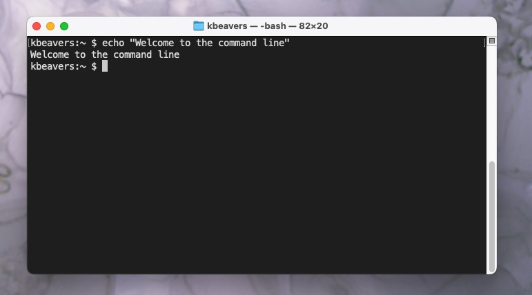

Linux Essentials
================

**Why Learn Linux & The Command-Line Interface**

Modern biological research is conducted primarily on **Linux-based systems**. Most research computing infrastructure, including the HPC clusters and cloud resources at TACC, runs Linux and supports software developed for Linux environments. 

These systems are accessed through a **command-line interface (CLI)**, a
text-based interface where users type commands to interact directly with a
computer. In research computing, the CLI is used to log into remote systems,
manage files, and launch computational analyses.

   A simple ``echo`` command typed into a terminal window, demonstrating the command-line interface.

Learning how to use the Linux command line interface is therefore an essential skill for modern biologists. Once you are comfortable working in a Linux environment, you can work on virtually any research computing system in the world. 

What You Will Learn
-------------------

In this section, students will learn how to:

* Describe basic functions of essential Linux commands
* Use Linux commands to navigate a file system and manipulate files
* Transfer data to / from a remote Linux file system
* Edit files directly on a Linux system using a command line utility (e.g., ``vim``, ``nano``)

Topics covered in this module include:

* Creating and navigating folders (``pwd``, ``ls``, ``mkdir``, ``cd``, ``rmdir``)
* Creating and manipulating files (``touch``, ``rm``, ``mv``, ``cp``)
* Looking at the contents of files (``cat``, ``more``, ``less``, ``head``, ``tail``, ``grep``)
* Network and file transfers (``ssh``, ``scp``, ``rsync``)
* Text editing (``vim``, ``nano``)

Log in to the Class Server
--------------------------

All computing for this course will take place on Linux virtual machines (VMs). To reach them, you will connect in two steps:

1. First, we'll connect to ``student-login.tacc.utexas.edu``. This is a persistent Linux VM at TACC that acts as a login gateway (jump host). 
2. Second, from ``student-login``, you'll connect to your own personal course VM. This VM is named ``mbs-337`` and is hosted on JetStream2. 

To connect from your own computer, you will use the **Secure Shell (SSH)** protocol through a CLI or an SSH client. The exact steps depend slightly on your computer's operating system. 

----

**Mac / Linux**

MacOS and Linux machines both include a terminal application by default. To open a terminal on macOS:

1. Press ``Command`` + ``Spacebar`` to open Spotlight search
2. Type **Terminal**
3. Press ``Enter``

From the terminal, connect to the TACC login VM (replace ``username`` with your TACC username):

.. code-block:: console

   ssh username@student-login.tacc.utexas.edu
   (enter password)
   (enter MFA token)

----

**Windows**

Windows does not include a native Linux shell by default to run the SSH protocol. That's okay – you just need to download an **SSH client**, which is a program that securely connects your computer to a remote Linux system. We recommend `PuTTY <https://www.chiark.greenend.org.uk/~sgtatham/putty/latest.html>`_ (Choose the 64-bit x86 installer). 

To connect:

.. code-block:: console

   Open the application 'PuTTY'
   Enter Host Name: student-login.tacc.utexas.edu
   (Click 'Open')
   (Enter username)
   (Enter password)
   (Enter MFA token)

----

**Chromebook**

Chromebooks can run a Linux shell using ChromeOS's built-in Linux support:

1. Open **Settings**
2. Go to **Advanced -> Developers**
3. Enable **Linux development environment**

Once enabled, you can open the Terminal app from your launcher and connect using SSH:

.. code-block:: console

   ssh username@student-login.tacc.utexas.edu
   (enter password)
   (enter MFA token)

----

**Confirming Your Login**

You have successfully connected to ``student-login`` when you see a message similar to this:

.. code-block:: console

   ------------------------------------------------------------------------------
   ------------------------------------------------------------------------------
   Welcome to the Texas Advanced Computing Center
      at The University of Texas at Austin

   ** Unauthorized use/access is prohibited. **

   If you log on to this computer system, you acknowledge your awareness
   of and concurrence with the UT Austin Acceptable Use Policy. The
   University will prosecute violators to the full extent of the law.

   TACC Usage Policies:
   http://www.tacc.utexas.edu/user-services/usage-policies/

   TACC Support:
   https://portal.tacc.utexas.edu/tacc-consulting

   ------------------------------------------------------------------------------
   kbeavers@student-login:~$ 

Once you are connected to ``student-login``, the next step is the same for everyone regardless of the operating system of your computer (since we are now all on the same Linux VM). 

From the ``student-login`` prompt, type:

.. code-block:: console

   ssh mbs-337

You won't need to provide a username or password this time, since your credentials are automatically forwarded from the login VM. 
 
If the connection is successful, you will see Jetstream2 status information similar to the following:

.. code-block:: console

   ══════════════════════════https://jetstream.status.io/══════════════════════════

   Overall Jetstream2 Status:   Operational 

   Active Status Items:
   ◦   Scarce availability of g3.xl resources 

   Scheduled Maintenance:
   ◦   (2026-01-02T12:00:00.000Z - 2026-01-03T00:00:00.000Z) Upcoming maintenance outage on January 2, 2026  

   ════════════════════════════════════════════════════════════════════════════════

At this point, you are successfully logged in to your personal Linux VM for the course and ready to begin working!

Creating and Navigating Folders
-------------------------------

On most personal computers, your location is shown visually using a graphical interface. For example, you might use your mouse to navigate to your Desktop or open files inside your Documents folder. 

In a Linux CLI, there is no visual file browser. Instead, you interact with the system by typing commands that ask the computer where you are and what files exist. 

.. tip::

    The text you see before your cursor is called the **command prompt**, and it provides useful information about your current session:

    .. code-block:: console
      
      kbeavers@mbs-337:~$

    * ``kbeavers`` = who you are logged in as
    * ``mbs-337`` = the system you are connected to
    * ``~`` = your current location (more on this later)
   
   You type commands after the ``$`` symbol

**Where Am I?**

To print your current location in the filesystem, use ``pwd`` (*print working directory*). In Linux, the terms "directory" and "folder" mean the same thing, and we'll use them interchangeably:

.. code-block:: console

   $ pwd
   /home/kbeavers

This is your **home directory**. This is where you start when you log in, and where your files and folders are stored. 

**What's Here?**

To see what files and folders exist in your current directory, use the ``ls`` (*list*) command:

.. code-block:: console

   $ ls

If nothing is printed, that simply means the directory is empty. 

**Creating Directories**

Let's create some directories using ``mkdir`` (*make directory*):

.. code-block:: console

   $ mkdir folder1
   $ mkdir folder2
   $ mkdir folder3

Let's list the contents again:

.. code-block:: console

   $ ls
   folder1 folder2 folder3

**Moving Around**

Now that we have some folders to work with, let's navigate into one of them. To move into a directory, use ``cd`` (*change directory*). This is analogous to double-clicking a folder on Windows or Mac.

.. code-block:: console

   $ pwd
   /home/kbeavers
   $ cd folder1
   $ pwd
   /home/kbeavers/folder1

Now that we are inside ``folder1``, make a few subdirectories:

.. code-block:: console

   $ mkdir subfolderA
   $ mkdir subfolderB
   $ mkdir subfolderC
   $ ls
   subfolderA subfolderB subfolderC

Navigate into ``subfolderA``, then use ``ls`` to list the
contents. What do you expect to see?

.. code-block:: console

   $ cd subfolderA
   $ pwd
   /home/kbeavers/folder1/subfolderA
   $ ls

There is nothing there because we have not made any files or directories here yet.

Next, we will navigate back to the home directory. So far we have seen how to navigate "down" into folders, but how do we navigate back "up" to the parent folder? There are
different ways to do this. 

You can specify the full **path**, which is the "address" to a file or directory within the filesystem: 

.. code-block:: console

   $ pwd
   /home/kbeavers/folder1/subfolderA
   $ cd /home/kbeavers/folder1
   $ pwd
   /home/kbeavers/folder1

Or, we could use the shortcut ``..``, which refers to the **parent directory** (the directory immediately above the current one).

.. code-block:: console

   $ pwd
   /home/kbeavers/folder1
   $ cd ..
   $ pwd
   /home/kbeavers

.. tip::

    From anywhere on the system, you can return to your home directory using ``~`` (remember our command prompt from earlier?) or simply ``cd`` with no arguments.

    .. code-block:: console
      
      $ cd ~
      $ pwd
      /home/kbeavers
      $ cd folder1
      $ pwd
      /home/kbeavers/folder1
      $ cd
      /home/kbeavers

**Removing Directories**

Now let's look at how to remove directories.

The command ``rmdir`` (*remove directory*) can be used to delete a directory *only if it is empty*:

.. code-block:: console

   $ mkdir junkfolder
   $ ls
   folder1 folder2 folder3 junkfolder
   $ rmdir junkfolder
   $ ls
   folder1 folder2 folder3

**Removing Non-Empty Directories**

Let's remove the other directories that we made. To remove a directory and everything inside it, use ``rm -r``

* ``rm`` means *remove*
* ``-r`` means *recursive* (delete everything inside, all the way down)

.. warning::

   ``rm -r`` permanently deletes files and directories. **There is no recycle bin on Linux systems, so use this command very carefully!**

Let's remove ``folder1`` and all of its contents:

.. code-block:: console

   $ rm -r folder1
   $ ls
   folder2 folder3

.. admonition:: Question

   Which command should we use to remove ``folder2`` and ``folder3``?

Creating and Manipulating Files
-------------------------------

So far, we've learned how to navigate the filesystem and perform operations with directories. But what about files? Just like on Windows or MacOS, Linux allows you to create, move, copy, rename, and delete files with the CLI.

**Creating and Removing Files**

First, let's make sure we are in our home directory and create a few directories and files. 

We'll use the ``touch`` command to create an empty file:

.. code-block:: console

   $ cd     # cd on an empty line will automatically take you back to the home directory
   $ pwd
   /home/kbeavers
   $ mkdir folder1
   $ mkdir folder2
   $ mkdir folder3
   $ touch file_a
   $ touch file_b
   $ touch file_c
   $ ls
   file_a  file_b  file_c  folder1  folder2  folder3

These files we have created are all empty. Removing a file is done with the ``rm`` (*remove*) command. 

.. code-block:: console

   $ touch junkfile
   $ rm junkfile

**Moving and Copying Files**

Files are moved or renamed using ``mv`` and copied using ``cp``. These commands work similarly to how you would expect on a Windows or Mac computer — the context around the move or copy operation determines what the result will be. In other words, ``mv`` and ``cp`` work on **paths**.

To demonstrate this, let's move ``file_a`` into ``folder1`` and ``file_b`` into ``folder2``. We'll also copy ``file_c`` into ``folder3``. 

.. code-block:: console

   $ mv file_a folder1/
   $ mv file_b folder2/
   $ cp file_c folder3/

.. admonition:: Question

   Take a moment to predict what the command ``ls`` would print if we used it in our current directory. 

.. code-block:: console

   $ ls
   file_c folder1  folder2  folder3
   $ ls folder1
   file_a
   $ ls folder2
   file_b
   $ ls folder3
   file_c

Two files have been moved into folders, and ``file_c`` has been copied - so there is still a copy of ``file_c`` in the home directory. 

Move and copy commands can also be used to change the name of a file:

.. code-block:: console

   $ cp file_c file_c_copy
   $ mv file_c file_c_new_name

.. tip::

   By now, you may have discovered that Linux is very unforgiving of typos. Three habits will save you a lot of frustration:

   * Press ``<Tab>`` to auto-complete file and directory names
   * Use ``<UpArrow>`` to cycle through previous commands
   * Avoid spaces and special characters in file names. Stick to:
  
    .. code-block:: text

      A-Z   # capital letters
      a-z   # lowercase letters
      0-9   # digits
      -     # hyphen
      _     # underscore
      .     # period     

Before we move on, let's clean up once again by removing the files and folders
we just created. 

.. code-block:: console

   $ rm -r folder1
   $ rm -r folder2
   $ rm -r folder3

How do we remove ``file_c_copy`` and ``file_c_new_name``?

.. code-block:: console

   $ rm file_c_copy
   $ rm file_c_new_name

Looking at the Contents of Files
--------------------------------

So far, we've been working with empty files and folders. Real research data, of course, is not empty. Let's start exploring the contents of actual files using more Linux commands. 

First, make sure you are in your home directory and copy a public file from the system into your own workspace. 

.. code-block:: console

   $ cd ~ 
   $ pwd
   /home/kbeavers
   $ cp /usr/share/dict/words .
   $ ls
   words

Try to use ``<Tab>`` to autocomplete the name of the file. Also, please notice the single dot ``.`` at the end of the copy command, which indicates that you want to copy the file to your **current location** (the home directory).

The ``words`` file is a standard dictionary file found on many Linux systems. It contains 479,828 words, each on its own line. To print the entire contents of the file to the screen, use ``cat``. 

.. code-block:: console

   $ cat words
   A
   AA
   AAA
   AA's
   AB
   ABC
   ABC's
   ABCs
   ABM
   ABM's
   ...

This is a long file! Printing everything to the screen is not very useful. We can use a few other commands to look at the contents of the file with "more" control. 

Instead of dumping everything to the screen at once, we can view files one screen at a time with the ``more`` command:

.. code-block:: console

   $ more words

Controls:

* Press the ``<Enter>`` key to scroll one line at a time
* Press the ``<Space>`` key to scroll one page at a time
* Press ``q`` to quit.

A progress indicator (``%``) at the bottom shows how far you are through the file. This is still a little bit messy and fills up the screen. 

A more commonly used alternative is the ``less`` command:

.. code-block:: console

   $ less words

Scrolling through the data is the same, but now we can also search the data. Press the ``/`` forward slash key, and type a word that you would like to search for. The screen will jump down to the first match of that word. The ``n`` key will cycle through other matches, if they exist. You can exit this view by pressing the ``q`` key. 

Finally, you can view just the beginning or the end of a file with the ``head``
and ``tail`` commands. For example:

.. code-block:: console

   $ head words
   $ tail words

By default, these commands show 10 lines, which is often enough for a quick check.

**Redirecting Output to Files**

Up to this point, all command output has gone to the screen. Linux allows you to redirect this output into files instead.

Use ``>`` to redirect the output of a command to a new file:

.. code-block:: console

   $ cat words > words_new.txt
   $ head words > first_10_lines.txt

A single greater than sign ``>`` will redirect and **overwrite** any contents in
the target file. A double greater than sign ``>>`` will redirect and **append**
any output to the end of the target file.

.. admonition:: Question

   What would happen if I ran the following?

   .. code-block:: console

      $ tail words >> first_10_lines.txt

   What about this?

   .. code-block:: console

      $ tail words > words_new.txt

   Be careful with these redirect commands – it is easy to accidentally overwrite or change the contents of files without meaning to!

**Searching Files with Grep**

Another essential tool is the ``grep`` command, which searches a file for a specific pattern, and returns all lines that match the pattern. For example:

.. code-block:: console

   $ grep "banana" words
   banana
   banana's
   bananas

Quotes around the search term are not always required, but they are a good habit — especially when searching for patterns that include spaces or special characters. 

Network and File Transfers
--------------------------

In biological research, you'll often need to transfer files between your local computer and remote computing systems. HPC systems like your course VM have computational resources and specialized software that aren't available on typical personal computers. File transfer allows you to leverage the strengths of both systems by moving data and results between them as needed.

To log in or transfer files to a remote Linux file system you must know the hostname (the unique network identifier of the computer you are connecting to) and the username (who you are). If you are already on a Linux file system, those are easy to determine using the following commands:

.. code-block:: console

   $ whoami
   kbeavers
   $ hostname
   mbs-337

As we learned earlier, connecting to your course VM requires two steps because we use a jump host:

1. First, we connected to ``student-login.tacc.utexas.edu`` (the jump host)
2. Then, from the jump host, we connected to ``mbs-337`` (your course VM)

Logging out of a remote system is done using the ``logout`` command, or the shortcut ``<Ctrl+d>``:

.. code-block:: console

   [kbeavers@mbs-337]$ logout
   [kbeavers@student-login]$ logout
   [local]$ 

Copying files from your local computer to your home folder on your Jetstream2 VM requires the same two-step process. 

*Step 1: Transfer from your local computer to the jump host*

We use the ``scp`` command (Windows users use a client "WinSCP") to first copy files from your local computer to the jump host:

.. code-block:: console

   [local]$ scp my_file kbeavers@student-login.tacc.utexas.edu:/home/kbeavers
   (enter password)
   (enter MFA token)

In this command, you specify:

* The file you want to transfer (``my_file``)
* Your TACC username (replace ``kbeavers`` with your actual TACC username)
* The hostname (``student-login.tacc.utexas.edu``)
* The destination path (in this case, your home directory)

Take careful notice of the separators including spaces, the ``@`` symbol, and the ``:``.

*Step 2: Transfer from the jump host to your course VM*

Now, log into the jump host and transfer the file to your course VM:

.. code-block:: console

   [local]$ ssh username@student-login.tacc.utexas.edu
   (enter password)
   (enter MFA token)
   [student-login]$ scp my_file mbs-337:/home/username

Notice that when transferring from ``student-login`` to ``mbs-337``, you don't need to specify a username or password because your credentials are automatically forwarded.

**Copying files from your VM to your local computer**

To copy files in the opposite direction (from your course VM to your local computer), reverse the process:

.. code-block:: console

   [student-login]$ scp mbs-337:/home/username/my_file . 
   [student-login]$ logout
   [local]$ scp username@student-login.tacc.utexas.edu:/home/username/my_file .
   (enter password)
   (enter MFA token)

.. tip::

   **Important: Where to Run File Transfer Commands**

   When transferring files between your local computer and a remote system, you must run the command from your local computer. This is because remote systems typically cannot initiate connections to local machines behind inbound firewall restrictions. 
   
   For transfers between ``student-login`` and ``mbs-337``, you can run the command from either machine because you are already authenticated. 

**Transferring Directories**

Instead of individual files, full directories can be copied using the "recursive" flag (``scp -r ...``). For example:

.. code-block:: console

   [local]$ scp -r my_folder username@student-login.tacc.utexas.edu:/home/username
   (enter password)
   (enter MFA token)
   ...
   [student-login]$ scp -r my_folder mbs-337:/home/username

**Alternative: Using rsync**

The ``rsync`` tool is an advanced copy tool that is useful for syncing data between two sites. It works similarly to ``scp`` but provides more options and can be more efficient for large transfers. Example usage:

.. code-block:: console

   [local]$ rsync -azv my_file username@student-login.tacc.utexas.edu:/home/username
   [student-login]$ rsync -azv my_file mbs-337:/home/username

The flags used here are:

* ``-a`` = archive mode (preserves permissions, timestamps, etc.)
* ``-z`` = compress data during transfer
* ``-v`` = verbose (show what's being transferred in the CLI)

This is just the basics of copying files. If you want to learn more, check out these resources:

* `scp usage <https://en.wikipedia.org/wiki/Secure_copy>`_ and example
* `rsync usage <https://en.wikipedia.org/wiki/Rsync>`_ for more info.

Text Editing with Nano 
----------------------

Nano is a simple, beginner-friendly text editor that is available on most Linux systems.
Nano operates in a single mode, making it easier to use for those new to command-line text editing.

.. code-block:: console

   $ nano file_name

Once nano opens, you can immediately start typing to edit the file. The editor displays helpful keyboard shortcuts at the bottom of the screen.

**Basic Nano Commands:**

The most important commands in nano are:

* ``Ctrl+O`` - Save (write **Out**) the file
* ``Ctrl+X`` - Exit nano
* ``Ctrl+K`` - Cut (delete) the current line
* ``Ctrl+U`` - Paste (uncut) the last cut line
* ``Ctrl+W`` - Search for text in the file
* ``Ctrl+\`` - Search and replace text

.. tip::

   When you try to exit with ``Ctrl+X``, nano will prompt you to save if you've made changes. Press ``Y`` to save, ``N`` to discard changes, or ``Ctrl+C`` to cancel and continue editing.

   The ``^`` symbol in nano's help text represents the ``Ctrl`` key. For example, ``^X`` means ``Ctrl+X``.

Nano is a great choice for quick edits and for users who prefer a more straightforward editing experience. For more advanced text manipulation, many users eventually learn VIM, which offers more powerful features but has a steeper learning curve.

Text Editing with VIM
---------------------

VIM is a text editor used on Linux file systems.

Open a file (or create a new file if it does not exist):

.. code-block:: console

   $ vim file_name

There are two "modes" in VIM that we will talk about today. They are called "insert mode" and "normal mode". In insert mode, the user is typing text into a file as seen through the terminal (think about typing text into TextEdit or Notepad). In normal mode, the user can perform other functions like save, quit, cut and paste, find and replace, etc. (think about clicking the menu options in TextEdit or Notepad). The two main keys to remember to toggle between the modes are ``i`` and ``Esc``.

Entering VIM insert mode:

.. code-block:: console

   > i

Entering VIM normal mode:

.. code-block:: console

   > Esc

A summary of the most important keys to know for normal mode are:

.. code-block:: text
   :emphasize-lines: 1,14

   # Navigating the file:

   arrow keys        move up, down, left, right
       Ctrl+u        page up
       Ctrl+d        page down

            0        move to beginning of line
            $        move to end of line

           gg        move to beginning of file
            G        move to end of file
           :N        move to line N

   # Saving and quitting:

           :q        quit editing the file
           :q!       quit editing the file without saving

           :w        save the file, continue editing
           :wq       save and quit

Review of Topics Covered
------------------------

**Part 1: Creating and navigating folders**

+------------------------------------+-------------------------------------------------+
| Command                            |  Effect                                         |
+====================================+=================================================+
| ``pwd``                            |  print working directory                        |
+------------------------------------+-------------------------------------------------+
| ``ls``                             |  list files and directories                     |
+------------------------------------+-------------------------------------------------+
| ``ls -l``                          |  list files in column format                    |
+------------------------------------+-------------------------------------------------+
| ``mkdir dir_name/``                |  make a new directory                           |
+------------------------------------+-------------------------------------------------+
| ``cd dir_name/``                   |  navigate into a directory                      |
+------------------------------------+-------------------------------------------------+
| ``rmdir dir_name/``                |  remove an empty directory                      |
+------------------------------------+-------------------------------------------------+
| ``rm -r dir_name/``                |  remove a directory and its contents            |
+------------------------------------+-------------------------------------------------+
| ``.`` or ``./``                    |  refers to the present location                 |
+------------------------------------+-------------------------------------------------+
| ``..`` or ``../``                  |  refers to the parent directory                 |
+------------------------------------+-------------------------------------------------+

**Part 2: Creating and manipulating files**

+------------------------------------+-------------------------------------------------+
| Command                            |          Effect                                 |
+====================================+=================================================+
| ``touch file_name``                |  create a new file                              |
+------------------------------------+-------------------------------------------------+
| ``rm file_name``                   |  remove a file                                  |
+------------------------------------+-------------------------------------------------+
| ``rm -r dir_name/``                |  remove a directory and its contents            |
+------------------------------------+-------------------------------------------------+
| ``mv file_name dir_name/``         |  move a file into a directory                   |
+------------------------------------+-------------------------------------------------+
| ``mv old_file new_file``           |  change the name of a file                      |
+------------------------------------+-------------------------------------------------+
| ``mv old_dir/ new_dir/``           |  change the name of a directory                 |
+------------------------------------+-------------------------------------------------+
| ``cp old_file new_file``           |  copy a file                                    |
+------------------------------------+-------------------------------------------------+
| ``cp -r old_dir/ new_dir/``        |  copy a directory                               |
+------------------------------------+-------------------------------------------------+
| ``<Tab>``                          |  autocomplete file or folder names              |
+------------------------------------+-------------------------------------------------+
| ``<UpArrow>``                      |  cycle through command history                  |
+------------------------------------+-------------------------------------------------+

**Part 3: Looking at the contents of files**

+------------------------------------+-------------------------------------------------+
| Command                            |          Effect                                 |
+====================================+=================================================+
| ``cat file_name``                  |  print file contents to screen                  |
+------------------------------------+-------------------------------------------------+
| ``cat file_name > new_file``       |  redirect output to new file                    |
+------------------------------------+-------------------------------------------------+
| ``more file_name``                 |  scroll through file contents                   |
+------------------------------------+-------------------------------------------------+
| ``less file_name``                 |  scroll through file contents                   |
+------------------------------------+-------------------------------------------------+
| ``head file_name``                 |  output beginning of file                       |
+------------------------------------+-------------------------------------------------+
| ``tail file_name``                 |  output end of a file                           |
+------------------------------------+-------------------------------------------------+
|  ``grep pattern file_name``        |  search for 'pattern' in a file                 |
+------------------------------------+-------------------------------------------------+
|  ``~/``                            |  shortcut for home directory                    |
+------------------------------------+-------------------------------------------------+
|  ``<Ctrl+c>``                      |  force interrupt                                |
+------------------------------------+-------------------------------------------------+
|  ``>``                             |  redirect and overwrite                         |
+------------------------------------+-------------------------------------------------+
|  ``>>``                            |  redirect and append                            |
+------------------------------------+-------------------------------------------------+

**Part 4: Network and file transfers**

+------------------------------------+-------------------------------------------------+
| Command                            |          Effect                                 |
+====================================+=================================================+
| ``hostname``                       |  print hostname                                 |
+------------------------------------+-------------------------------------------------+
| ``whoami``                         |  print username                                 |
+------------------------------------+-------------------------------------------------+
| ``ssh username@hostname``          |  remote login                                   |
+------------------------------------+-------------------------------------------------+
| ``logout``                         |  logout                                         |
+------------------------------------+-------------------------------------------------+
| ``scp local remote``               |  copy a file from local to remote               |
+------------------------------------+-------------------------------------------------+
| ``scp remote local``               |  copy a file from remote to local               |
+------------------------------------+-------------------------------------------------+
|  ``rsync -azv local remote``       |  sync files between local and remote            |
+------------------------------------+-------------------------------------------------+
|  ``rsync -azv remote local``       |  sync files between remote and local            |
+------------------------------------+-------------------------------------------------+
|  ``<Ctrl+d>``                      |  logout of host                                 |
+------------------------------------+-------------------------------------------------+

**Part 5: Text editing with VIM**

+------------------------------------+-------------------------------------------------+
| Command                            |          Effect                                 |
+====================================+=================================================+
| ``vim file.txt``                   |  open "file.txt" and edit with ``vim``          |
+------------------------------------+-------------------------------------------------+
| ``i``                              |  toggle to insert mode                          |
+------------------------------------+-------------------------------------------------+
| ``<Esc>``                          |  toggle to normal mode                          |
+------------------------------------+-------------------------------------------------+
| ``<arrow keys>``                   |  navigate the file                              |
+------------------------------------+-------------------------------------------------+
| ``:q``                             |  quit editing the file                          |
+------------------------------------+-------------------------------------------------+
| ``:q!``                            |  quit editing the file without saving           |
+------------------------------------+-------------------------------------------------+
|  ``:w``                            |  save the file, continue editing                |
+------------------------------------+-------------------------------------------------+
|  ``:wq``                           |  save and quit                                  |
+------------------------------------+-------------------------------------------------+

Additional Resources
--------------------

* `Practice Linux commands safely in a web-based emulator <https://bellard.org/jslinux/vm.html?url=alpine-x86.cfg&mem=192>`_
* `This is a good summary of the important commands you need to know <https://linuxjourney.com/lesson/the-shell>`_
* `Practice VIM in a web browser <http://openvim.com/>`_
* Practice VIM on the command line by typing ``vimtutor``