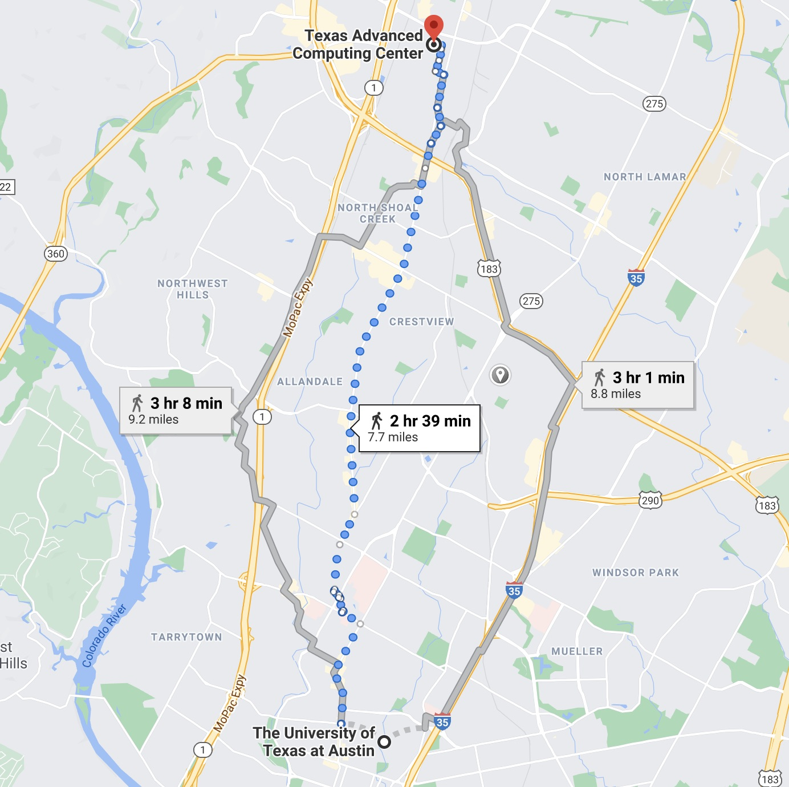
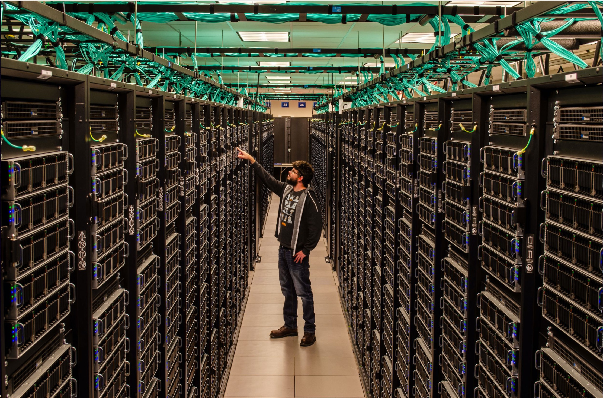
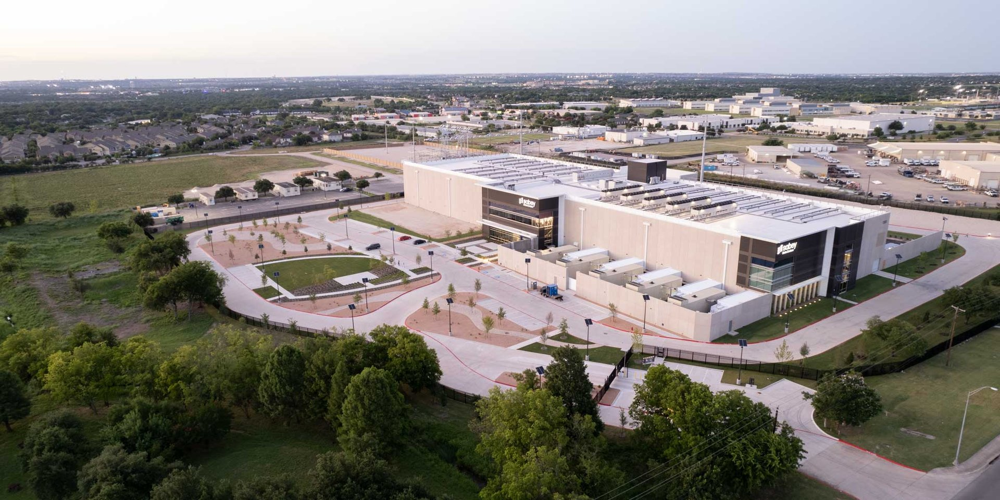
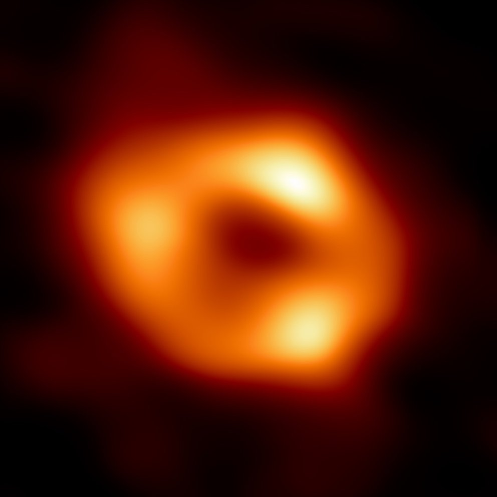
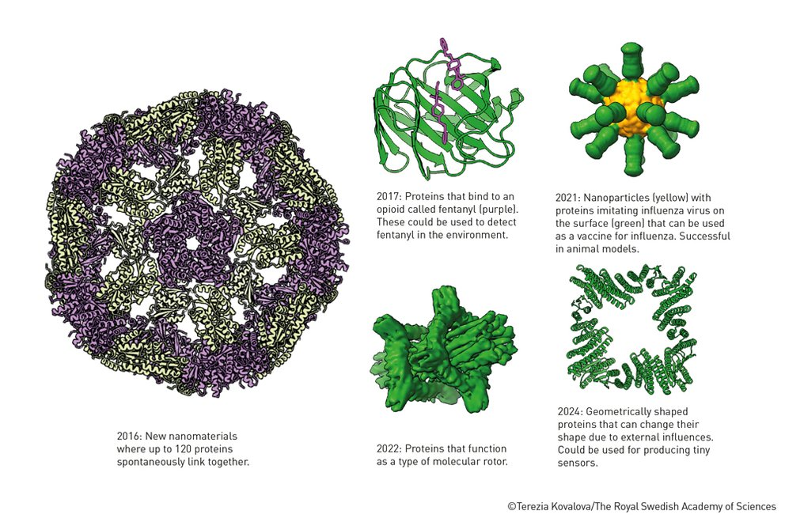
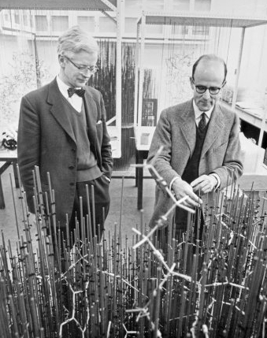

Onboarding to TACC
==================

The Texas Advanced Computing Center (TACC) at UT Austin designs and operates some of the most powerful computing systems in the world.
These systems enable discoveries across every scientific domain and allow us to investigate some of the most computationally demanding problems in modern biology. 

In this course, you will use cloud computing resources at TACC to learn how modern biological research is carried out in practice. 
**You will need a TACC username, password, and multifactor token for this class.**

.. attention::

    Everyone please apply for a TACC account now using `this link <https://portal.tacc.utexas.edu/web/tup/account-request>`_.
    If you already have a TACC account, you may use your existing one. Send your TACC username to the course instructors via e-mail as soon as possible (see below). 

.. code-block:: console

    To: kbeavers@tacc.utexas.edu, wallen@tacc.utexas.edu, eferlanti@tacc.utexas.edu
    From: you
    Subject: MBS-337 TACC Account
    Body: Please include your name, EID, and TACC username.
        
    Additionally, please answer these questions:
     - Do you have any experience with programming? If so, what language(s)?
     - What are your goals in taking this class? What do you want to learn?

About TACC
----------

TACC is a Research Center within UT Austin, located at the J.J. Pickle Research Campus. TACC is primarily funded by the National Science Foundation (NSF) to provide large scale computing resources to the open science community. We are the research computing facility for UT Austin and the UT System – and the largest academic supercomputing center in the United States.

    A short 7.7 mile walk from main campus!

.. figure:: images/building.jpg 
    :width: 700px
    :align: center

    One of two TACC buildings located at J.J. Pickle.

    A tall person standing among taller Frontera racks.

    Sabey Data Center, the home of TACC's new Horizon Supercomputer. 
    
**Key Facts:**

- 200+ staff (including ~80 Ph.D. research scientists)
- 40,000+ active users working on 3,000+ projects per year
- >100,000 total users since 2001 – including 90,000 students
- TACC users have earned 4 Nobel prizes and numerous "first-of-its-kind" achievements
- ~20,000 servers, >1 million CPU cores, >1,000 GPUs

Our mission: *Enable discoveries that advance science and society through the application of advanced computing technologies.*

**TACC powers discoveries that change the world:**

    The first direct image of Sagittarius A — the supermassive black hole at the center of the Milky Way — enabled by large-scale data analysis on TACC supercomputers. Credit: Event Horizon Telescope/NSF.

    Novel proteins designed by Nobel laureate David Baker using AI methods such as RoseTTAFold, enabled by TACC supercomputers. This breakthrough opens the door to a future where we can design entirely new molecules to address challenges in medicine, materials science, and global health.

Why Biologists are Turning to HPC
----------------------------------

For most of its history, biology advanced through **slow, manual observation** — limited by human speed, human vision, and human comprehension. Think Linnaeus naming and organizing species one at a time and Mendel tracking inheritance in pea plants generation by generation. 

Even as biology progressed into the 20th century, the pace of discovery remained bound by these limits. 

**Example: X-ray crystallography**

X-ray crystallography revolutionized molecular biology by letting scientists "see" proteins in atomic detail, but only after *years* of purification, coaxing proteins into crystal form, collecting their diffraction patterns, and building up an atomic model by hand. Solving one structure could easily take an entire Ph.D. 

Biology was becoming more precise, but not necessarily faster, and certainly not scalable.

    Kendrew (left) and Perutz, the scientists who solved the 3D structure of myoglobin in the 1960s using x-ray crystallography and the 'forest of rods' model they built by hand. 

**A New Era of Biology**

In the 1990s, biology began to undergo a transformation unlike anything in its history. 

Launched in 1990 and completed in 2003, the **Human Genome Project** produced the first sequence of the entire human genome: 2.85 billion nucleotides spanning ~20,000–25,000 protein-coding genes. 

.. figure:: ./images/hgp.png
    :width: 600px
    :align: center

    The human genome printed in a series of books more than a thousand pages each, in type so small it is barely legible. Source: `Wikipedia/Russ London <https://commons.wikimedia.org/wiki/File:Wellcome_genome_bookcase.png#:~:text=Summary&text=English:%20The%20first%20printout%20of,as%20to%20be%20barely%20legible.&text=Own%20work%20(Original%20text:%20I,this%20work%20entirely%20by%20myself.%20)>`_ 

For the first time, biology had the blueprint for an entire organism, but the impact of the Human Genome Project went far beyond the genome itself. 

**Biology Becomes a Data Science**

As the Human Genome Project unfolded:

- **Computers** were rapidly becoming more powerful
- New **sequencing technologies** were being invented and improved almost yearly, making data generation faster and cheaper
- Entirely new fields such as **computational biology** and **bioinformatics** emerged because the volume of data far exceeded what humans could analyze manually

All of a sudden, the tools required to do biology changed almost overnight. Biologists needed to learn technologies and methods once associated only with computer science:

- **Linux and the command-line interface** — because sequencing data no longer fit on personal computers
- **Python** — to analyze datasets too large for Excel or point-and-click interfaces 
- **Common biological data formats** such as FASTA, FASTQ, SAM/BAM, and VCF — the new "language" of biology
- **Git & Version Control** — to collaborate across institutions and ensure reproducibility of analyses
- **Containerization** — to package scientific software so it can run anywhere
- **High-performance computing (HPC)** — to run computationally demanding genome assemblies, alignments, simulations, and machine learning models too large for personal computers
- **Artificial intelligence** — emerging methods that now drive breakthroughs across all domains of science

In short, **biology became a computational science**, and the next era of biological discovery will come from researchers who can move fluently between data analysis, computer science, and biological insight. 

Where This Course Fits In
------------------------

This is one of the most exciting moments in the history of biology. Just a few years ago in 2020, the `protein folding problem` — a grand challenge that had stumped scientists for over 50 years — was finally solved by **AlphaFold2**, a revolutionary AI system that can predict protein structures with near-experimental accuracy. 

.. figure:: ./images/casp14_predictions.gif
    :width: 700px
    :align: center

    Comparison between experimentally determined protein structures (green) and predictions made by AlphaFold2 (blue), indicating the remarkable accuracy of AI-based computational methods in protein structure prediction. Source: `GitHub/Google-Deepmind <https://github.com/google-deepmind/alphafold>`_

AlphaFold unlocked a completely new way of doing structural biology, and the possibilities of biological research are expanding faster than ever. Those who understand computational methods will be well-positioned at the forefront of discovery. 

This course is designed to equip you with the necessary tools and skills required for modern biological research. Whether your interests lie in genomics, ecology, neuroscience, medicine, microbiology, or biotechnology, the computational foundations you build here will prepare you for how biological research is done in practice. 

Over the course of the semester, you will understand not only *why* biology requires HPC, but also *how to use it* to solve real scientific problems. 

You will learn how to:

- **Analyze real genomics, transcriptomics, and medical datasets** using command-line and Python tools
- **Work with core bioinformatics file formats** (FASTA, FASTQ, SAM/BAM/VCF) and understand how data flows through computational pipelines
- **Use Git and GitHub** for version control, collaboration, and managing computational workflows
- **Package and share scientific software** using containers
- **Deploy an interactive scientific dashboard** similar to those used by active research labs for real-time analysis and visualization
- ... and much more!

.. attention::

   **Reminder**: If you haven't already, please send the required email to the course instructors 
   (see instructions at the beginning of this document). This email includes your name, EID, TACC 
   username, and answers to the programming experience and course goals questions. 
   
   **This email counts as your first homework assignment**, so please complete it as soon as possible.
    