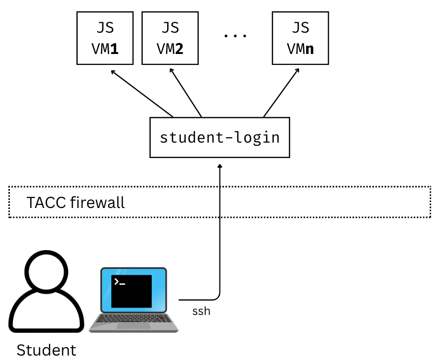
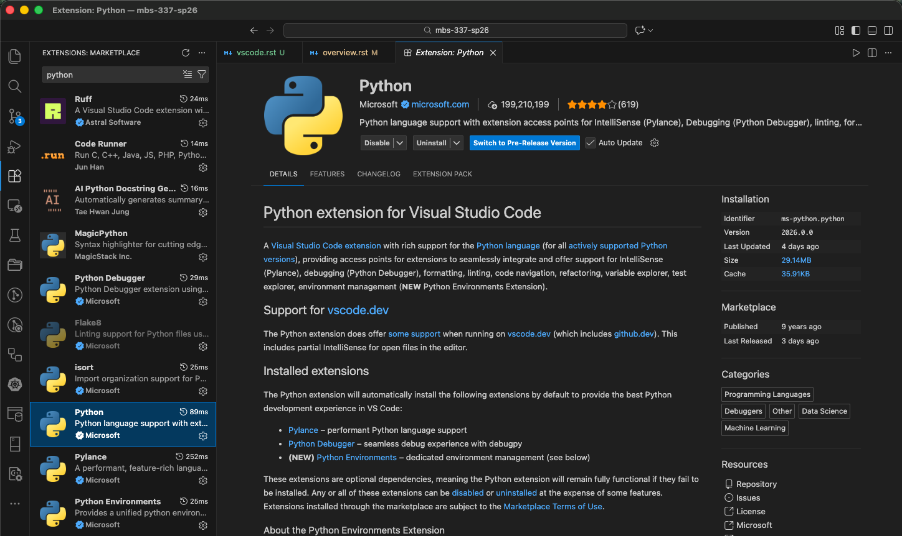
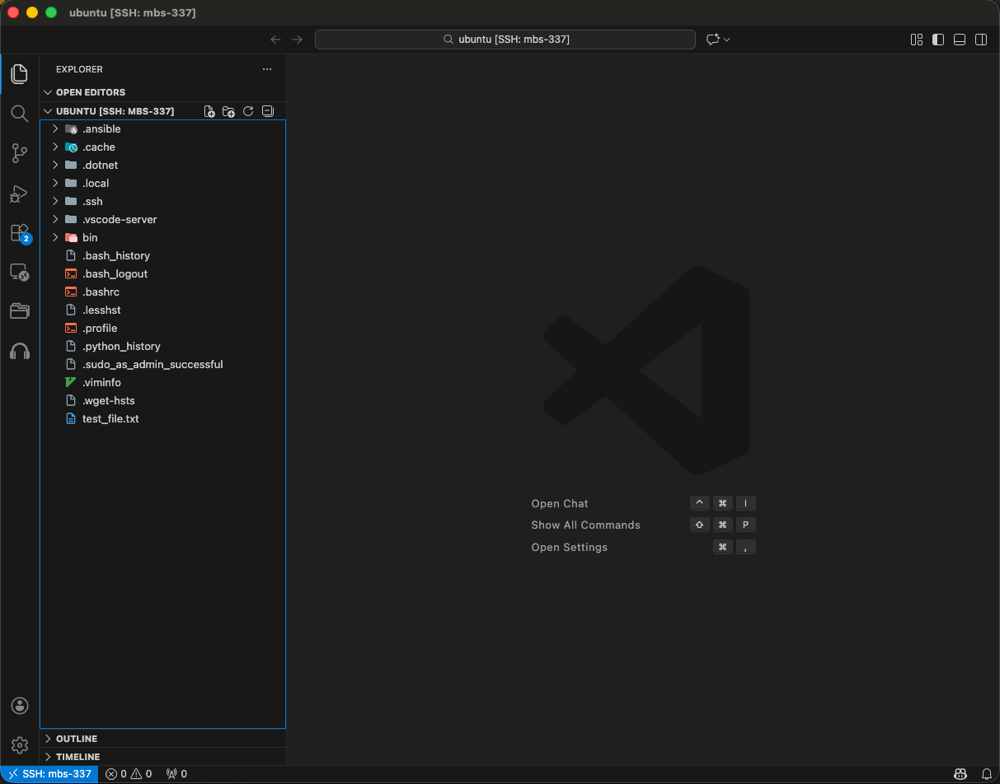

Using Your Class Virtual Machine
=================================

Every student in the class will have their own virtual machine (VM) to do work. We highly recommend
that you use your class VM to work on the in-class exercises and take-home projects. The VMs have the Linux OS and some other software installed for you that will make getting started easier. Also,
we (the teaching staff) have access to all of the VMs and can help you in case something goes very wrong.

SSH Access To Your VM
----------------------
Once you have provided the instructors with your TACC account and your VM has been created,
you can use the following steps to ssh to it. For security purposes, the student VMs will be behind a
firewall and will not be directly accessible to the public internet.

   Controlled access architecture for Jetstream2 VMs.

To access your VM via SSH, you will need to first SSH to the login VM. This year, the login VM will be
located at: **student-login.tacc.utexas.edu**

Steps to SSH to Student VM:

1. First, SSH to the login VM (student-login.tacc.utexas.edu) using your TACC username, password and MFA token.
2. From ``student-login.tacc.utexas.edu``, type ``ssh mbs-337``. This should connect you to your personal VM as user ``ubuntu``.

You should see the prompt change in your terminal. The two steps are depicted below:

**Step 1:** SSH from your laptop to student-login:

.. code-block:: console
   :emphasize-lines: 1-3,22

   [local]$ ssh username@student-login.tacc.utexas.edu
   (username@student-login.tacc.utexas.edu) Password:
   (username@student-login.tacc.utexas.edu) TACC_Token:
   Welcome to Ubuntu 20.04.6 LTS (GNU/Linux 5.4.0-216-generic x86_64)
   ...
   ------------------------------------------------------------------------------
   Welcome to the Texas Advanced Computing Center
   at The University of Texas at Austin

   ** Unauthorized use/access is prohibited. **

    If you log on to this computer system, you acknowledge your awareness
    of and concurrence with the UT Austin Acceptable Use Policy. The
    University will prosecute violators to the full extent of the law.

    TACC Usage Policies:
    http://www.tacc.utexas.edu/user-services/usage-policies/

    TACC Support:
    https://portal.tacc.utexas.edu/tacc-consulting
   ------------------------------------------------------------------------------
   username@student-login:~$

**Step 2:** SSH from student-login.tacc.utexas.edu to your VM:

.. code-block:: console
   :emphasize-lines: 1,21

   username@student-login:~$ ssh mbs-337

   System information as of Tue Jan 13 01:13:53 UTC 2026

    System load:  0.04               Processes:               167
    Usage of /:   22.8% of 47.39GB   Users logged in:         1
    Memory usage: 19%                IPv4 address for enp3s0: 192.168.1.54
    Swap usage:   0%

   ══════════════════════════https://jetstream.status.io/══════════════════════════

   Overall Jetstream2 Status:   Operational

   Active Status Items:
    ◦   Scarce availability of g3.xl resources

   ════════════════════════════════════════════════════════════════════════════════

   Last login: Tue Jan 13 01:12:35 2026 from 129.114.4.186
   ubuntu@mbs-337:~$

Working With VSCode and the VM
------------------------------

We will be writing code in VSCode this semester, a modern Interactive Development
Environment (IDE) with many advanced features for software engineering such as
syntax highlighting, code completion and interactive debugging.
Our setup will involve having VSCode running on your local laptop while all the
actual code we write and execute will run on your dedicated VM. In this setup,
you can think of VSCode somewhat like a "web browser" with the actual source code living
on the VM.

There are a few advantages to this approach, including:

 1) Your code can be accessed remotely from different computers, and different individuals
    can access the running code (including the instructors and TAs, who can help troubleshoot issues);
 2) All students code will execute in the same environment (Linux OS with the same CPU cores and memory,
    etc.)

Installing VSCode on Your Laptop
--------------------------------
Here are the instructions for installing VSCode on your computer, based on your operating system:

 * Linux -- Follow the instructions `here. <https://code.visualstudio.com/docs/setup/linux>`_
 * Mac -- Follow the instructions `here. <https://code.visualstudio.com/docs/setup/mac>`_
 * Windows -- Follow the instructions `here. <https://code.visualstudio.com/docs/setup/windows>`_

**You only need to follow the first step to install the actual VSCode application**. Next, we're going to install the following additional plugins. 

Installing the Necessary VSCode Plugins
^^^^^^^^^^^^^^^^^^^^^^^^^^^^^^^^^^^^^^^
Open the Extensions view by either clicking Extensions from the left navbar (the icon with two
squares and a diamond) or by using the ``Ctrl+Shift+X`` (Linux/Windows) or ``Cmd+Shift+X`` (Mac) key combination.

You will see the extensions organized into lists of "Installed", "Recommended", etc. You can also
search for extensions by typing into the search box. Install the following extensions:

* Python (from Microsoft) -- Core Python development functionality.
* Pylance (from Microsoft) -- Advanced Python development features (requires the Python extension).
* Remote-SSH (from Microsoft) -- Provided support for developing code on remote servers using an SSH
  connection.
* Ruff (from Astral Software) -- Fast Python linter and formatter.

To install a plugin, click the plugin from the Extensions tab and then click "install".

.. warning::

    In general, make sure you are installing VSCode extensions from Microsoft or a trusted source.
    If you search for popular extension names, such as "python", you likely to find multiple
    extensions.

    Installing the Python extension.

VSCode IDE via Remote-SSH Plugin
--------------------------------

Now we will connect to code installed
on the VM using VSCode and the Remote-SSH plugin.

The easiest way I have found to do this is to
create an SSH config file with an entry for your VM,
and then use that alias in VSCode.

For more details and alternatives, see the documentation for Remote SSH [1].

1. Install VSCode and SSH client on your machine (if not already installed).

2. Install the Remote-SSH client (if not already installed -- go to Extensions (``Ctrl+Shift+X`` or ``Cmd+Shift+X`` on Mac), type "Remote-SSH" and click ``Install``)

3. **Set up SSH keys for VM authentication**

    VSCode Remote-SSH requires SSH key authentication to connect to remote servers. Your course VMs 
    (``mbs-337``) are Jetstream2 VMs that cannot be accessed directly from the internet - they are 
    behind TACC's firewall. To reach them, VSCode must connect through a jump host called 
    ``student-login``, which is a persistent VM at TACC that also exists behind TACC's firewall. 
    The SSH keys allow VSCode to authenticate to your VM through this jump host. You will still need 
    to provide your username, password, and MFA token when connecting to ``student-login``, but once 
    through the jump host, VSCode will use your SSH key to authenticate to ``mbs-337`` automatically.

    First, check if you already have SSH keys on your local machine:

    .. code-block:: console

        $ ls ~/.ssh/id_*

    If you see files like ``id_rsa``, ``id_ed25519``, or ``id_ecdsa``, you already have SSH keys.
    Note which one you have (we'll use ``id_ed25519`` as an example, but use whichever key type you have).

    If you don't have SSH keys, generate one:

    .. code-block:: console

        $ ssh-keygen -t ed25519 -C "your_email@example.com"

    Press ``Enter`` to accept the default file location (``~/.ssh/id_ed25519``) and optionally set a passphrase. 

4. **Add your public key to the mbs-337 vm**

    You now need to copy your public key to the ``~/.ssh/authorized_keys`` file on your VM.
    First, get your public key:

    **On Mac:**

    .. code-block:: console

        $ pbcopy < ~/.ssh/id_ed25519.pub 

    This copies your public key to your clipboard.

    **On Windows (PowerShell):**

    .. code-block:: powershell

        PS> Get-Content ~/.ssh/id_ed25519.pub | Set-Clipboard

    Now, SSH to your VM using the two-step process described earlier:

    .. code-block:: console

        [local]$ ssh username@student-login.tacc.utexas.edu
        (enter password)
        (enter MFA token)
        [student-login]$ ssh mbs-337

    Once connected to your VM, add your public key to the authorized_keys file:

    .. code-block:: console

        [ubuntu@mbs-337]$ vim ~/.ssh/authorized_keys

    In vim, press ``i`` to enter insert mode, paste your public key, then press ``Esc`` and type ``:wq`` to save and exit.

    While you are here, get the IP address for your VM (you'll need this for the SSH config in step 5):

    .. code-block:: console

        [ubuntu@mbs-337]$ curl ip.me  
        129.114.xx.yy # Copy this IP address

5. **Create SSH config file**

    On your local laptop, edit the file ``~/.ssh/config`` to contain the following:

    .. code-block:: bash

        Host student-login-jump
            HostName student-login.tacc.utexas.edu
            User your_tacc_username
            IdentityFile ~/.ssh/id_ed25519
            ForwardAgent yes

        Host mbs-337
            HostName 129.114.xx.yy
            User ubuntu
            IdentityFile ~/.ssh/id_ed25519
            ProxyJump student-login-jump

.. note::

    * Replace ``your_tacc_username`` with your actual TACC username
    * Replace ``id_ed25519`` with your actual key type if different (e.g., ``id_rsa``)
    * Insert the IP address for your server here (the output of ``curl ip.me`` on your student VM)

Each entry in the config file instructs SSH about how to connect to that host.
Once entered, SSH'ing to a host in the config is as easy as using the alias:

.. code-block:: bash

    $ ssh mbs-337

Notes:
  * In the first line, the part after ``Host`` is the alias.
    You can use any name you like, but it should be memorable.
  * The part after ``HostName`` (i.e., ``student-login.tacc.utexas.edu`` or ``129.114.xx.yy``) should be the actual domain name of the login machine or the IP address of your student server.
  * The string after ``User`` should be the remote account to connect with.

6. **Connect VSCode to your VM**

    Now, in a VSCode window, open the Command Palette (``Ctrl+Shift+P`` or ``Cmd+Shift+P`` on Mac) and type
    "remote-ssh: Connect to host", and then:

 a. You should see the alias appear (in my case, I have additional aliases, but the ``mbs-337`` is the one we want). If you do not see it, there is probably an issue with your configs.

    .. figure:: ./images/VSCode-remote-ssh-1.png
        :width: 1000px
        :align: center
        :alt: Remote SSH drop down with aliases from the ssh config file

        Remote SSH drop down with aliases from the ssh config file

 b. The first time, you may be prompted to select the OS type (choose Linux)

 c. Once you select the OS type, a new VSCode window will open up and connect to the machine.

    .. figure:: ./images/VSCode-remote-ssh-2.png
        :width: 1000px
        :align: center
        :alt: New VSCode window with Remote SSH

        New VSCode window with Remote SSH

.. note::

    If you get a "connection timeout" error, you may need to increase the Remote SSH connection
    timeout in your VSCode settings. To do that, do the following:
    1. Open the Command Palette in VS Code (``Ctrl+Shift+P`` or ``Cmd+Shift+P`` on Mac).
    2. Type and select "Preferences: Open Settings UI".
    3. Search for "Remote.SSH: Connect Timeout".
    4. Change the value from the default 15 to 30 (or higher, like 60).

Choose the ``File -> Open Folder...`` menu option or click the ``Open Folder`` button in the Explorer and select the ``/home/ubuntu`` directory to see the
complete listing.

    Remote listing of files on the VM

Summary
-------

That was a lot of steps! Let's make sure we understand what we just did:

**The Challenge:**
We want to edit files and run code through the VSCode IDE interface, but we want everything to actually 
happen on the VM instead of our local machine. However, your course VMs are Jetstream2 VMs that cannot 
be accessed directly from the internet - they are behind TACC's firewall. To reach them, we must connect 
through a jump host called ``student-login``, which is a persistent VM at TACC.

**What We Set Up:**

1. **SSH Keys**: We generated a key pair (private key stays on your laptop, public key goes on the VM). 
   VSCode Remote-SSH requires SSH key authentication to work. The SSH keys allow VSCode to authenticate 
   to your VM (``mbs-337``) through the jump host (``student-login``).

2. **SSH Config File**: We created a configuration file that tells SSH:
   
   - How to connect to the jump host (``student-login``)
   - How to connect to your VM (``mbs-337``) through the jump host using ProxyJump
   - Which SSH key to use for authentication to the VM

3. **VSCode Remote-SSH**: We configured VSCode to use your SSH config, so it can automatically route 
   through the bastion (``student-login``) to connect to your VM and run a VSCode server there.

**How It Works:**

When you click "Connect to Host" in VSCode:

- VSCode reads your SSH config file
- You'll be prompted for your username, password, and MFA token to connect to ``student-login`` (the bastion/jump host)
- Once through the jump host, VSCode uses your SSH key to authenticate to ``mbs-337``
- Connects through the jump host (``student-login``) to reach your VM (``mbs-337``) using ProxyJump
- Installs and runs a VSCode server component on the VM
- Your local VSCode becomes a remote client