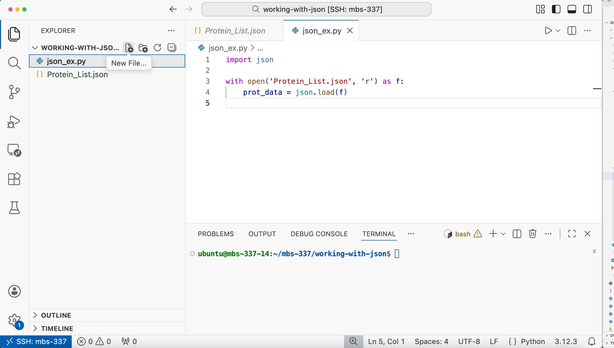

Working with JSON
=================

In this hands-on module, we will learn how to work with the JSON data format.
JSON (JavaScript Object Notation) is a powerful, flexible, and lightweight data
format that we see a lot in the biosciences, especially when working with
databases like UniProt, web APIs, and bioinformatics tools.

After going through this module, students should be able to:

* Identify and write valid JSON
* Read JSON into an object in a Python3 script
* Loop over and work with elements in a JSON object
* Write JSON to file from a Python3 script

JSON Basics
-----------

JSON (JavaScript Object Notation) is a lightweight, human-readable text format used to
store, organize, and exchange data. You can think of JSON as a structured way to store
information so that both humans and computers can easily read it. 

Although JSON was originally built on JavaScript syntax, it is now an open, language-
independent standard. It is supported by nearly all modern programming languages. 
Many bioinformatics tools and databases rely on JSON to store and exchange data. 

JSON is built from a small number of basis data types. These types can be combined
and nested inside one another, which allows JSON to represent complex biological 
data in a structured way.

1. **Primitive types**: These are the simplest possible values in JSON:
 * Numbers: integers and floating-point values (``-1``, ``12``, ``3.14``)
 * Strings: text values, always written in double quotes (``"abc"``)
 * Booleans: logical true/false values (must be written in lowercase: ``true``, ``false``)
 * Null: represents missing or unknown data (``null``)

2. **Objects (also called dictionaries)**: Objects store named values using ``name: value`` pairs
and are enclosed in curly braces ``{ }``.
 * The name (key) must always be a string
 * Each key must be unique
 * The value can be *any valid JSON type* (including another object or a list)

3. **Arrays (also called lists)**: Arrays store ordered collections of values and are enclosed
in square brackets ``[ ]``.
 * Values can be of mixed types
 * Duplicate values are allowed
 * Items are separated by commas

Each of the following is a valid JSON value:

.. code-block:: python3

  # a JSON string 
  "abc"

  # a JSON integer
  -1

  # A JSON float 
  3.14

  # a JSON boolean -- note the lowercase
  true 

  # a JSON list -- note the mix of primitive types and duplicated values 
  [ "abc", -1, 12, false, "abc"]

  # a JSON dictionary -- keys must be strings and must be unique 
  {
    "key1": "abc", 
    "key2": -1, 
    "key3": false 
  }

The recursive nature of JSON objects means that any valid JSON value can be placed inside another
JSON structure:

.. code-block:: json 

    [
        {
        "id": 1,
        "username": "kbeavers",
        "is_student": false
        },
        {
        "id": 2,
        "username": "cyz",
        "is_student": true
        }
    ]

In this example:
 * The outer structure is a list
 * Each item in the list is a dictionary
 * Each dictionary stores metadata about one user

This pattern (a list of records, where each record is a dictionary) is extremely common in computational biology and bioinformatics.

EXERCISE
~~~~~~~~

We'll be working through some examples by writing some code on your student VM. We'll use VSCode for these 
interactions. Open a VSCode RemoteSSH session (``Cmd+Shift+P`` -> ``RemoteSSH``) and create a new 
terminal (``Cmd+Shift+P`` -> ``Terminal: Create New Terminal``). 

Within the terminal inside VSCode on your class VM, navigate to your ``mbs-337`` project directory that you created 
last time and create a new directory within there called ``working-with-json``:

.. code-block:: console 

    [vm]$ cd mbs-337
    [vm]$ mkdir working-with-json
    [vm]$ cd working-with-json

(You can also right-click from within the file explorer view and select New Folder...)

Find a sample JSON file using `this link <./sample-data/uniprot_proteins_simple.json>`_ and copy and paste the contents into a new file called ``Protein_List.json``.

.. note::

   The protein data is adapted from `UniProt <https://www.uniprot.org/>`_, a comprehensive resource for protein
   sequence and functional information.

Plug this file (or some of the above samples) into an online JSON validator
(e.g. `JSONLint <https://jsonlint.com/>`_). Try making manual changes to some of
the entries to see what breaks the JSON format.

Read JSON into a Python3 Script
-------------------------------

The ``json`` library is part of Python's standard library, which means it's already 
available — you don't need to install it or set up a virtual environment. 

Create a new Python script called ``json_ex.py`` in your ``working-with-json`` directory. 
In VSCode, you can do this by:

* Within the file explorer, open the ``working-with-json`` directory
* Click the ``New File`` button next to the ``working-with-json`` text (icon looks like a file with a plus sign)
* Typing ``json_ex.py`` as the filename

The file will open automatically in the editor for you to start coding. 

.. warning::

   Do not name your Python3 script "json.py". If you ``import json`` when there
   is a script called "json.py" in the same folder, it will import that instead
   of the actual ``json`` library.

The code you need to read the JSON file of protein data into
a Python3 object is:

.. code-block:: python3
   :linenos:

   import json

   with open('Protein_List.json', 'r') as f:
       prot_data = json.load(f)

Only three simple lines!

* We ``import json`` from the standard library so that we can work with the ``json`` module. 
* We use the safe ``with open...`` statement to open the file read-only into a filehandle called ``f``. 
* Finally, we use the ``load()`` function from the ``json`` module to load the contents of the JSON file into our new ``prot_data`` object.

   Your VS Code screen should look like this

EXERCISE
~~~~~~~~

Add code to your script to print out the ``prot_data`` object to the screen. 
Execute the script in the VSCode terminal. 

.. toggle:: Click to see the answer

   All that is required is that we add a ``print(prot_data)`` to the end of the script.

   .. code-block:: python3
      :linenos:

      import json

      with open('Protein_List.json', 'r') as f:
          prot_data = json.load(f)
          print(prot_data)

   We can execute the script in the terminal using the following command:

   .. code-block:: console

      [vm]$ python3 json_ex.py

EXERCISE
~~~~~~~~
Within the Python3 interpreter's interactive mode, let's:

* Explore the types of the various objects within ``prot_data`` by making calls to the ``type()`` function.
* Use the ``keys()`` function to see what keys are available within the dictionaries. 
* Finally, ``print()`` each of these as necessary to be sure you know what each is. 

Be able to explain the output of each call to ``type()`` and ``print()``.

.. code-block:: console

    [vm]$ python3

.. code-block:: python3

    >>> import json
    >>>
    >>> with open('Protein_List.json', 'r') as f:
    ...     prot_data = json.load(f)
    ...
    >>> type(prot_data)
    >>> print(prot_data.keys())
    >>> print(prot_data['protein_entries'])
    >>> print(type(prot_data['protein_entries']))
    >>> print(prot_data['protein_entries'][0])
    >>> print(type(prot_data['protein_entries'][0]))
    >>> print(prot_data['protein_entries'][0].keys())
    >>> print(type(prot_data['protein_entries'][0]['mass']))
    >>> print(prot_data['protein_entries'][0]['mass'])

Modeling Data with Pydantic: A First Look 
------------------------------------------

If we look at an example protein entry from the data, we see a common structure: 

.. code-block:: json 

    {
      "proteinName": "Myoglobin",
      "organism": "Homo sapiens",
      "className": "oxygen carrier",
      "mass": 17184,
      "length": 154
    }

Each entry is a dictionary with the following set of five keys and the associated 
types of the values: 

 * ``proteinName`` -- string 
 * ``organism`` -- string
 * ``className`` -- string (e.g., molecular function or protein family) 
 * ``mass`` -- integer (molecular weight in Daltons)
 * ``length`` -- integer (number of amino acids in the sequence) 

The Pydantic Python library provides a powerful facility for modeling data 
using Python types. Using Pydantic models allows us to automatically 
validate and work with data in a robust way. 

EXERCISE
~~~~~~~~

Before we can use Pydantic, we need to install it!
Do you remember how we install new Python libraries?

.. toggle::

    First, we need to activate our **Python Virtual Environment** from
    earlier in the course. You can use the relative or full path to activate
    the virtual environment:

    .. code-block:: console

        [mbs-337]$ source ../myenv/bin/activate # OR
        [mbs-337]$ source /home/ubuntu/mbs-337/myenv/bin/activate
        (myenv) [mbs-337]$
    
    
    After activating, we will use ``pip3 install``
    to install the Pydantic Python package library to this virtual environment.

    .. code-block:: console

        (myenv) [mbs-337]$ pip3 install pydantic

To start modeling data with Pydantic, we define a model using 
the ``BaseModel`` that resembles the data in our application. For example, 
we could create a model to represent a protein entry with the following 
code: 

.. code-block:: python 
    :linenos:

    from pydantic import BaseModel

    class ProteinEntry(BaseModel):
        proteinName: str
        organism: str
        className: str
        mass: int
        length: int

Let's break down what this code does:

1. In the first line, we import the ``BaseModel`` class from the ``pydantic`` library. 
2. In line 3, we define a new Python class called ``ProteinEntry`` to model our protein data. 
3. In lines 4-8, we define a template for our model:
 * Each line inside the class defines a field (property) of our model
 * Format: ``field_name: type``
 * The indentation shows these fields belong to the ``ProteinEntry`` class

**What is data modeling?**
This ``ProteinEntry`` model is a *template* that describes the structure of any protein entry. 
It's like a blueprint: the Myoglobin example we saw earlier matches this structure, and any 
other protein entry we create must also follow this same template.

Using Our Pydantic Model
------------------------

Now that we have a ``ProteinEntry`` model, what can we do with it? 
The first thing we can do is use it to create protein entry objects. 
We do this by simply passing values for each of the fields, just like if 
we were calling a function: 

.. code-block:: python 

    protein1 = ProteinEntry(proteinName="Myoglobin", 
                            organism="Homo sapiens",
                            className="oxygen carrier",
                            mass=17184, 
                            length=154)

The code above works and creates a new ``ProteinEntry`` object called 
``protein1``. Moreover, each of the fields is accessible using "dot notation"; 
for example, ``protein1.proteinName`` has type ``str`` and value ``Myoglobin``. 

EXERCISE
~~~~~~~~
Use dot notation and the ``type`` function to verify the values and types of 
the other fields on ``protein1``. 

We can create additional ``ProteinEntry`` objects by simply passing 
additional sets of values. For example, 

.. code-block:: python 

    protein2 = ProteinEntry(proteinName="Hemoglobin subunit beta", 
                            organism="Homo sapiens", 
                            className="oxygen carrier",
                            mass=15998, 
                            length=147)

    protein3 = ProteinEntry(proteinName="Insulin", 
                            organism="Canis lupus familiaris", 
                            className="hormone", 
                            mass=12190, 
                            length=110)
    . . . 

What would you expect would happen though if we tried to do the following? 

.. code-block:: python 

    protein4 = ProteinEntry(proteinName="Cytochrome c oxidase subunit 12, mitochondrial", 
                            organism="Saccharomyces cerevisiae", 
                            className="oxidoreductase", 
                            mass=9788, 
                            length="abc")

.. toggle:: Click to see explanation

    There is something wrong with the data: we've stated in the data model that 
    ``length`` should be a field of type ``int``, however we are passing in a string.

    Fundamentally, this data type is breaking from what our model has described, and this
    could cause problems within our code down the line. For example, if we were trying to 
    perform some kind of computation with ``length``, our code could break if we tried
    to perform arithmetic on a string when we expect an integer. 

**Finding Errors with Pydantic**

Pydantic is a powerful tool because it allows us to detect these errors in a controlled way. 
If we execute the code above we see the following error: 

.. code-block:: python 

    ValidationError: 1 validation error for ProteinEntry
    length
    Input should be a valid integer, unable to parse string as an integer [type=int_parsing, input_value='abc', input_type=str]
        For further information visit https://errors.pydantic.dev/2.12/v/int_parsing

Validating JSON Data 
--------------------

When we read JSON data from a file, we get a Python dictionary. We can then use that 
dictionary to create a validated ``ProteinEntry`` object. Let's see how this works:

**Step 1: JSON -> Python Dictionary**

When we read JSON from a file, it becomes a Python dictionary. For example, the first protein in ``Protein_List.json`` 
looks like this in JSON format:

.. code-block:: json 

    {
      "proteinName": "Myoglobin",
      "organism": "Homo sapiens",
      "className": "oxygen carrier",
      "mass": 17184,
      "length": 154
    }

After using ``json.load()``, this becomes a Python dictionary:

.. code-block:: python3

    with open('Protein_List.json', 'r') as f:
        prot_data = json.load(f)
        prot_1_dict = prot_data['protein_entries'][0]

    print(prot_1_dict)

.. code-block:: console 

    {'proteinName': 'Myoglobin', 'organism': 'Homo sapiens', 'className': 'oxygen carrier', 'mass': 17184, 'length': 154}

**Step 2: Dictionary -> Pydantic Object**

We have a dictionary with all our protein data. Now we need to turn it into a 
``ProteinEntry`` object. 

Earlier when we created ``ProteinEntry`` objects, you manually wrote out 
each field name and value like this:

.. code-block:: python 

    protein1 = ProteinEntry(proteinName='Myoglobin', 
                            organism='Homo sapiens',
                            className='oxygen carrier',
                            mass=17184,
                            length=154)

But we already have all this information in our dictionary! Instead of typing 
it all out again, we can use ``**prot_1_dict`` to tell Python: "*Take everything from this 
dictionary and use it to create the ProteinEntry*."

We can simply write:

.. code-block:: python 

    protein1 = ProteinEntry(**prot_1_dict)

The ``**`` (two asterisks) is Python's way of saying "unpack this dictionary".
It takes all the key-value pairs and uses them as arguments. The dictionary keys 
must match the field names in our ``ProteinEntry`` model.

**Step 3: Validation Happens Automatically**

Pydantic validates the data when we create the object. What do you think would happen 
if we tried to create a ``ProteinEntry`` with invalid data?

.. code-block:: python 

    d = {'proteinName': 'Myoglobin',
         'organism': 'Homo sapiens',
         'className': 'oxygen carrier',
         'mass': 'heavy',  # This should be an integer!
         'length': 154}
    
    protein1 = ProteinEntry(**d)

EXERCISE
~~~~~~~~
Previously, we read the ``Protein_List.json`` file into Python. 
Modify your script to read the data into a **list** of ``ProteinEntry`` 
**objects** using the ``**`` unpacking operator we just learned about.

.. toggle:: Click to see the solution

    .. code-block:: python 

        import json
        from pydantic import BaseModel 

        class ProteinEntry(BaseModel):
            proteinName: str
            organism: str
            className: str
            mass: int
            length: int

        proteins = []
        with open('Protein_List.json', 'r') as f:
            prot_data = json.load(f)
        for prot in prot_data["protein_entries"]:
            proteins.append(ProteinEntry(**prot))

Now that you have a list of ``ProteinEntry`` objects, you can use dot notation to access 
their fields! Here are some examples:

.. code-block:: python3

    # Access the protein name of the first protein in the list
    proteins[0].proteinName
    # --> 'Myoglobin'

    # Access the mass of the second protein in the list
    proteins[1].mass
    # --> 15998

    # Loop through all proteins and print their names
    for protein in proteins:
        print(protein.proteinName)

Work with JSON Data
-------------------

Now that we have our protein data loaded as ``ProteinEntry`` objects, let's write some 
functions to analyze them. 

When we write functions, we can tell Python what type of data the function expects 
and what it will return. This is called a **type hint**. For example, if a function 
takes a *list of ProteinEntry objects* and returns a *float*, we can write that in the function 
definition. This makes our code easier to read and understand — just by looking at 
the function, you can see what it needs and what it gives back.

.. code-block:: python3

    def some_function(proteins: list[ProteinEntry]) -> float: 

EXERCISE
~~~~~~~~

**Function 1: Find the Protein with the Largest Mass**

Write a function that takes a list of ProteinEntry objects and returns the name and mass of the protein
with the largest mass. 

Think about:

* What should the function take as input? (Hint: a list of ``ProteinEntry`` objects)
* How do you find the protein with the largest mass? (Hint: start with placeholder variables for ``largest_protein`` and ``largest_mass``, then loop through all proteins and track the largest mass seen so far)
* How do you return both the protein name AND its mass? (Hint: return a list with two items — the name first, then the mass)

.. toggle:: Click to see the solution

    .. code-block:: python3
       :linenos:

        def find_largest_mass(proteins: list[ProteinEntry]) -> list:
            largest_protein = None
            largest_mass = 0
            
            for protein in proteins:
                if protein.mass > largest_mass:
                    largest_mass = protein.mass
                    largest_protein = protein.proteinName
            
            return [largest_protein, largest_mass]

        # Test it
        result = find_largest_mass(proteins)
        print(f"{result[0]} has the largest mass at {result[1]} Daltons")

    Here's how it works:
    
    * Line 1: The function takes a list of ``ProteinEntry`` objects and returns a list
    * Lines 2-3: We start by keeping track of the largest protein we've found so far 
      (set to None) and the largest mass (set to 0)
    * Lines 5-8: We loop through each protein. If a protein's mass is larger than 
      what we've seen so far, we update our records
    * Line 10: We return a list containing the protein name and its mass
    * Lines 13-14: We test the function. We get the result as a list and access the 
      first item using ``result[0]`` to print the protein name and access the second item 
      using ``result[1]`` to print the protein's mass.

**Function 2: Find Proteins by Organism**

Write a function that takes a list of proteins and an organism name (like "Homo sapiens"), 
and returns a new list containing only the proteins from that organism.

Think about:

* What should the function take as input? 
* How do you check if a protein's organism matches? 
* How do you build a new list? (Hint: start with an empty list ``[]`` and use ``append()``)

.. toggle:: Click to see the solution

    .. code-block:: python3
       :linenos:

       def filter_by_organism(proteins: list[ProteinEntry], organism: str) -> list:
           result = []
           for protein in proteins:
               if protein.organism == organism:
                   result.append(protein.proteinName)
           return result
       
       # Find all human proteins
       human_proteins = filter_by_organism(proteins, "Homo sapiens")
       print(human_proteins)

    Here's what each part does:
    
    * Line 1: The function takes a list of ``ProteinEntry`` objects and an organism name (str), and returns a list (of proteins)
    * Line 2: We create an empty list to store our results
    * Lines 3-5: We loop through each protein. If the protein's organism matches 
      the one we're looking for, we add the proteinName to our result list
    * Line 6: We return the list of matching proteins
    * Lines 9-10: We test the function by finding all human proteins and printing them to the screen.

Write JSON to File
------------------

Now let's learn how to create a JSON file from scratch. We'll create a simple 
dataset description and save it as a JSON file.

**Step 1: Define a New Model**

First, we'll create a Pydantic model for a dataset.

.. code-block:: python3
   :linenos:

   import json
   from pydantic import BaseModel 
   
   class Dataset(BaseModel):
       accession: str
       id: int
       title: str
       dataType: str

**Step 2: Create a Dataset Object**

Now we'll create an example dataset using our model:

.. code-block:: python3

   dataset1 = Dataset(accession='PRJNA1412539', 
                      id=1412539,
                      title='Transposon-insertion sequencing uncovers nlpD as the essential gene for intracellular persistence and infectivity of Salmonella',
                      dataType='Raw sequence reads')

**Step 3: Write to a File**

To save this to a JSON file, we need to:

1. Convert the Pydantic object to a dictionary using the ``.model_dump()`` method from the Pydantic library

2. Use ``json.dump()`` to write it to a file

    The basic syntax for ``json.dump()`` is ``json.dump(obj, file_object)``, where:
    
    * ``obj`` is the Python object you want to convert, and
    * ``file_object`` is the pointer to a file opened in write (``'w'``) or append (``'a'``) mode. 

.. code-block:: python3
   :linenos:

   with open('dataset.json', 'w') as out:
       json.dump(dataset1.model_dump(), out, indent=2)

Let's break this down:

* ``with open('dataset.json', 'w')`` opens a file called "dataset.json" for writing 
  (the ``'w'`` means "write mode")
* ``out`` is the name we give to the open file — you can think of it as a connection 
  to the file
* ``dataset1.model_dump()`` converts our Pydantic object into a regular Python 
  dictionary
* ``json.dump()`` writes that dictionary to the file as JSON
* ``indent=2`` makes the JSON file easier to read by adding indentation (this is 
  optional but recommended)

After running this code, you'll have a new file called ``dataset.json`` in your 
working directory. Open it and check that it looks like valid JSON!

Additional Resources
--------------------

* `Reference for the JSON library <https://docs.python.org/3/library/json.html>`_
* `Validate JSON with JSONLint <https://jsonlint.com/>`_
* `UniProt <https://www.uniprot.org/>`_ — protein sequence and functional annotation
