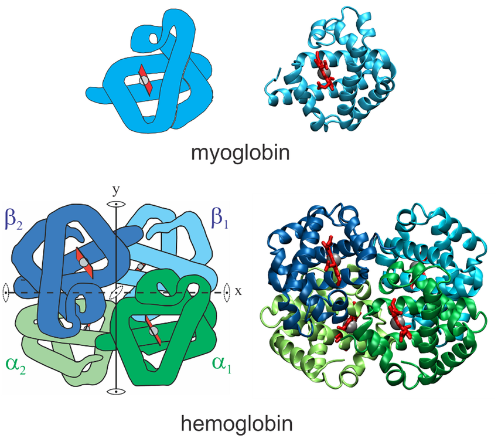

Working with Structure Data (PDBx/mmCIF)
====================================

In this hands-on module, we will learn how to work with the mmCIF data format.
mmCIF is the modern, machine-friendly format used by the `RCSB Protein Data Bank (PDB) <https://www.rcsb.org/>`_
to store 3D macromolecular structures and their associated metadata.

mmCIF files are used to represent experimentally determined and computationally
predicted structures, including proteins, nucleic acids, and molecular complexes.

After completing this module, students should be able to:

* Identify and understand valid mmCIF files
* Explain what types of information mmCIF stores (atoms, residues, chains, metadata)
* Read mmCIF files into Python objects using Biopython
* Navigate the structure hierarchy (Structure → Model → Chain → Residue → Atom)
* Extract common data (coordinates, residue IDs, chain IDs, B-factors, occupancy)
* Write or export structures back to mmCIF format

Macromolecular structure context 
--------------------------

mmCIF files describe **macromolecular structures**, meaning the three-dimensional
positions of atoms in a biological system. While many entries in the Protein Data Bank
are proteins, mmCIF is not protein-specific. It can represent a wide range of
structures, including:

* Proteins and protein complexes
* DNA and RNA
* Protein–nucleic acid complexes
* Small-molecule ligands, ions, cofactors, and waters

Biological function depends strongly on 3D shape. Binding sites, active sites,
molecular recognition, and molecular interactions are determined by how atoms and
residues are arranged in space. Structural data come from experiments such as X-ray
crystallography, NMR spectroscopy, and cryo-electron microscopy, or from computational
prediction methods such as `AlphaFold <https://alphafold.ebi.ac.uk/>`_.

The Protein Data Bank archives these structures so they can be analyzed, visualized,
and compared.

.. figure:: images/RCSB_1MBN.png
    :width: 1000px
    :align: center

    Structure summary of PDB Entry `1MBN <https://www.rcsb.org/structure/1MBN>`_.

    *Fun fact: this was the first protein to have its 3D structure revealed by
    X-ray crystallography. John Kendrew was awarded the Nobel Prize in Chemistry 
    in 1962 for this achievement.*

What is mmCIF?
-------------------

**PDBx/mmCIF**, or simply **mmCIF**, stands for "Macromolecular CIF". This name is derived from 
the "Crystallographic Information File (CIF)" format, which was created to store small molecule 
crystallographic experiments. mmCIF uses the same syntax and file extension as CIF (``.cif``), 
but uses a different, much larger, and extensible dictionary. 

.. note::

    Note: The PDB now exclusively uses mmCIF (PDBx/mmCIF) for archiving data, 
    making it the essential format for modern structural biology, whereas standard 
    CIF is mostly used in chemical crystallography. 

A typical mmCIF contains:

* Atom-level coordinates (x, y, z) for each atom
* Atom identity (element, atom name), residue identity (amino acid), chain identity
* Optional values like occupancy and B-factor (temperature factor)
* Experimental metadata (method, resolution, authors, citations)
* Chemical component definitions (ligands, modified residues)

mmCIF Format Basics
-------------------

While mmCIF files can be intimidating at first, they are built from just a few core concepts.
At a high level, an mmCIF file consists of:

* **Data Blocks**: contain information for one structure (some mmCIF files contain multiple structures)
* **Data items**: single name-value pairs for metadata fields 
* **Loops**: contains tables with rows corresponding to column names (more on this below)

Data Blocks
+++++++++++++++

Every mmCIF file begins with a **data block**, which is introduced by a line starting with ``data_``:

.. code-block:: text

    data_1MBN

The text after ``data_`` is the data block identifier, usually the PDB ID (e.g. "1MBN").
A data block defines a logical boundary for one structure entry. 

Important rules:

* A file may contain one or more data blocks
* Each data block describes one structure
* A data block ends when another ``data_`` line is encountered or the file ends

Data Items (Name-Value Pairs)
++++++++++++++++++++++++++++++++

The simplest information in a mmCIF file is stored as **data items**, which are single
name-value pairs:

.. code-block:: text

    _struct.title   'The stereochemistry of the protein myoglobin'

This line has three parts:

* ``_struct.title``: The data item **name**
* ``'The stereochemistry of the protein myoglobin'``: The **value**
* Whitespace separates name from values 

All mmCIF data item names begin with a leading underscore and have the form
``_category.keyword``. In the example above:

* ``_struct`` = the category 
* ``title`` = the keyword (which must be unique within the category)

.. note:: Data Items Syntax:

    * Data item names are not case-sensitive

    * Each data item must have **exactly one value**

    * Values may be numbers, short strings (quoted or unquoted), or special placeholders:

       * ``?`` = value is missing
       * ``.`` = value is not applicable or intentionally omitted 

**Text Values and Multi-line Strings**

Short text values may be enclosed in single or double quotes, or can be unquoted:

.. code-block:: text

    _entity_src_gen.gene_src_common_name               'sperm whale' 
    _entity_src_gen.gene_src_genus                     Physeter 
    _entity_src_gen.pdbx_gene_src_scientific_name      'Physeter catodon' 

Long text values that span multiple lines are enclosed by semicolon delimiters 
placed at the start of a line:

.. code-block:: text

    _entity_poly.pdbx_seq_one_letter_code       
    ;VLSEGEWQLVLHVWAKVEADVAGHGQDILIRLFKSHPETLEKFDRFKHLKTEAEMKASEDLKKHGVTVLTALGAILKKKG
    HHEAELKPLAQSHATKHKIPIKYLEFISEAIIHVLHSRHPGDFGADAQGAMNKALELFRKDIAAKYKELGYQG
    ;

Everything between the semicolons is treated as a single text value. 

Loops (Tables)
+++++++++++++++++

Many types of data occur multiple times (atoms, residues, authors, citations, etc.). 
These are stored using the ``loop_`` directive, which defines a table. 
A loop has two parts:

1. A list of column names (data item names)
2. Rows of values corresponding to those columns

For example, let's take a look at the simplified ``_atom_site`` loop. This is often the 
most crucial information contained in a mmCIF file:

.. code-block:: text

    loop_
    _atom_site.label_atom_id 
    _atom_site.label_comp_id 
    _atom_site.Cartn_x 
    _atom_site.Cartn_y 
    _atom_site.Cartn_z 
    N  VAL  -2.900  17.600  15.500  
    C  VAL  -3.600  16.400  15.300
    C  VAL  -3.000  15.300  16.200
    O  VAL  -3.700  14.700  17.000

The first line (``loop_``) starts the table. Then, the lines starting with ``_atom_site.`` define the 
**columns** of the table:
 * ``label_atom_id``: The atom name within the residue (e.g., N, C, O)
 * ``label_comp_id``: The residue name (here, VAL = valine)
 * ``Cartn_x``, ``Cartn_y``, ``Cartn_z``: The atom's x, y, and z coordinates in 3D space (in Ångströms)

Each line below the headers provides values for **one atom**, in the same order as the column header. 
For example, the first row:

.. code-block:: text

    N  VAL  -2.900  17.600  15.500  

means: Atom N (the backbone nitrogen) in residue VAL (valine) is located at coordinates (−2.900, 17.600, 15.500) Å

Working with mmCIF files
------------------------

Let's get some practice working with mmCIF files. We'll use VSCode for these exercises.
Open a VSCode RemoteSSH session and create a new terminal.

Within the terminal inside VSCode on your class VM, navigate to your ``mbs-337/working-with-bio-data`` project directory.

We're going to use a new command called ``wget`` to download a mmCIF file directly from 
`RCSB PDB <https://www.rcsb.org/>`_. This command allows us to retrieve files directly from the internet
by providing a URL to the data we want to download. 

Within your VS Code terminal, use the below command to download the mmCIF file for PDB Entry `1MBN <https://www.rcsb.org/structure/1MBN>`_.

.. code-block:: console

    [mbs-337]$ wget https://files.rcsb.org/download/1MBN.cif.gz

.. code-block:: console 

    --2026-02-02 21:44:40--  https://files.rcsb.org/download/1MBN.cif.gz
    Resolving files.rcsb.org (files.rcsb.org)... 13.33.82.83, 13.33.82.18, 13.33.82.74, ...
    Connecting to files.rcsb.org (files.rcsb.org)|13.33.82.83|:443... connected.
    HTTP request sent, awaiting response... 200 OK
    Length: unspecified [application/gzip]
    Saving to: ‘1MBN.cif.gz’

    1MBN.cif.gz                               [ <=>     ]  36.54K  --.-KB/s    in 0.02s   

    2026-02-02 21:44:40 (2.15 MB/s) - ‘1MBN.cif.gz’ saved [37416]

You now have a file called ``1MBN.cif.gz`` in your ``working-with-bio-data`` directory!
If you try to open this file, you'll see that it does not display in the text editor. That's 
because we downloaded a compressed version of the mmCIF — the ``.gz`` file ending means that
this file has been compressed using the GNU Zip (Gzip) algorithm to reduce the file size
for storage and faster transfer. 

The first thing we need to do is decompress this file to its original format:

.. code-block:: console

    [mbs-337]$ gunzip 1MBN.cif.gz

The ``.gz`` file ending should be gone now, and you should be able to view your mmCIF
file in the text editor.

Helpful Linux Commands
++++++++++++++++++++++

You can inspect an mmCIF file from the command line:

.. code-block:: bash

    # Print the first 20 lines
    [mbs-337]$ head -n 20 1MBN.cif

    # Find the title of the structure
    [mbs-337]$ grep "_struct.title" 1MBN.cif

    # Find lines that start a data block
    [mbs-337]$ grep "^data_" 1MBN.cif

Read mmCIF from File
++++++++++++++++++++++

Biopython provides **MMCIFParser** in ``Bio.PDB`` for reading ``.cif`` files. The parser
converts the text file into a **Structure** object that you can query and iterate over.
Activate your Python virtual environment and create a file called ``mmcif_ex.py``:

.. code-block:: python3

    from Bio.PDB.MMCIFParser import MMCIFParser

    # Create a parser using the MMCIFParser Class (blueprint)
    parser = MMCIFParser()

    with open('1MBN.cif', 'r') as f:
        # Use .get_structure method on our parser to create a structure object
        structure = parser.get_structure('myoglobin', f)
        print(structure)

The ``get_structure()`` method takes two inputs:

1. **An ID** — a short name you choose (e.g. ``'myoglobin'``)
2. **A file handle** — the open mmCIF file

.. tip::

    mmCIF files can be large. The parser loads the structure into memory so you can query
    it easily. For most single-protein structures this is fine; very large complexes may
    require more memory or streaming approaches.

Understanding the structure hierarchy
~~~~~~~~~~~~~~~~~~~~~~~~~~~~~~~~~~~~~~

Biopython represents a structure using a hierarchy:

.. code-block:: text

    Structure: top-level, one per file
    └──Model: Possible 3D arrangement of the atoms (usually just 1)
        └──Chain: Continuous polymers (e.g., hemoglobin is composed of four globin chains)
            └──Residue: Monomers (e.g., GLY, ALA, VAL, etc.)
                └──Atom: Individual atoms (e.g., N, C, O, etc.) with 3D coordinates

For example, imagine this structure:

.. code-block:: text

    Structure
    └── Model 0
        └── Chain A
            └── Residue 1: LEU
                └── Atom: N
                └── Atom: CA
                └── Atom: C
                └── Atom: O
            └── Residue 2: VAL
                └── Atom: N
                └── Atom: CA
                └── Atom: C
                └── Atom: O
                └── Atom: CB
                └── Atom: CG1
                └── Atom: CG2

English translation: One structure file, with one model, containing one protein chain (A) made of 
amino acids, each built from atoms. 

You typically iterate with nested loops over ``structure`` → ``model`` → ``chain`` →
``residue`` → ``atom``. For example, to count chains, residues, and atoms:

.. code-block:: python3

    num_models = 0
    num_chains = 0
    num_residues = 0
    num_atoms = 0

    for model in structure:
        num_models += 1
        for chain in model:
            num_chains += 1
            for residue in chain:
                num_residues += 1
                for atom in residue:
                    num_atoms += 1

    print(f"Models: {num_models}")
    print(f"Chains: {num_chains}")
    print(f"Residues: {num_residues}")
    print(f"Atoms: {num_atoms}")

.. code-block:: console

    Models: 1
    Chains: 1
    Residues: 153
    Atoms: 1210

Each object in our structure has an ``id`` (e.g., ``model.get_id()``, ``chain.get_id()``, etc.)

.. code-block:: python3

    for model in structure:
        print(f"Model: {model.get_id()}")
        for chain in model:
            print(f"Chain: {chain.get_id()}")

.. code-block:: console

    Model: 0
    Chain: A

Most structures, like this one, have only one model. Some NMR or computationally-predicted structures
may have many models (an **ensemble**). If we had an ensemble of models, their IDs would be printed 
in numerical order, starting at 0. 

We also see that our structure only has one chain (A). This is because myoglobin is made up of 
a single polypeptide chain. Some structures are made up of multiple polymers. For example, 
hemoglobin is a **tetramer**, consisting of four polypeptide chains. In this case, 
we would have Chains A, B, C, and D. 

    Structures of myoglobin and hemoglobin. Notice how hemoglobin is composed of four 
    polypeptide chains: two alpha chains and two beta chains.
    Source: `Eaton 2021 <https://link.springer.com/article/10.1007/s10867-021-09588-3?utm_source=researchgate.net&utm_medium=article>`_

Let's see what happens when we use ``residue.get_id()``. We'll also use ``residue.get_resname()`` 
to print the name of each residue:

.. code-block:: python3

    for model in structure:
        for chain in model:
            for residue in chain:
                print(residue.get_resname(), residue.get_id())

.. code-block:: console

    VAL (' ', 1, ' ')
    LEU (' ', 2, ' ')
    SER (' ', 3, ' ')
    ...
    GLY (' ', 153, ' ')
    OH ('H_OH', 154, ' ')
    HEM ('H_HEM', 155, ' ')

Now this is interesting! When we use ``residue.get_resname()``, we see the actual names 
of each residue within Chain A (e.g., VAL, LEU, etc.). We know from earlier that our 
chain is made up of 155 residues, but not all of these are amino acids! The last two lines in 
our output show that residue 154 is OH (a hydroxide ion), and residue 155 is HEM (a heme group).

The output of ``residue.get_id()`` is much different from what we've seen thus far. Each 
residue ID is a **tuple** with three elements:

.. code-block:: text

    (hetfield, resseq, icode)

* ``hetfield`` = The **hetero-field** identifies whether the residue is a standard amino/nucleic acid or something else:

   * ``' '`` = standard amino acids and nucleic acids
   * ``W`` = water molecule
   * ``H_name`` = Other hetero-residues (e.g., H_OH for hydroxide ion)

* ``resseq`` = The **sequence identifier** is an integer describing the position of the residue in the chain 

* ``icode`` = The **insertion code** is a string that is sometimes used to preserve a certain desirable numbering scheme.

   * For example, a Ser 80 insertion mutant (inserted between a Thr 80 and an Asn 81 residue) could look like this:

    .. code-block:: text

        THR (' ', 80, 'A')
        SER (' ', 80, 'B')
        ASN (' ', 81, ' ')

Finally, we can use ``atom.get_id()`` with ``atom.get_coord`` to print each atom and its 3D
coordinates (*x, y, z*) for the first residue:

.. code-block:: python3

    for model in structure:
        for chain in model:
            for residue in chain:
                for atom in residue:
                    print(residue.get_resname(), atom.get_id(), atom.get_coord())
                break

.. code-block:: text

    VAL N [-2.9 17.6 15.5]
    VAL CA [-3.6 16.4 15.3]
    VAL C [-3.  15.3 16.2]
    VAL O [-3.7 14.7 17. ]
    VAL CB [-3.5 16.  13.8]
    VAL CG1 [-2.1 15.7 13.3]
    VAL CG2 [-4.6 14.9 13.4]

This code returned the residue name of the first residue in our chain (VAL), along with 
each atom (N, CA, C, etc.) and its 3D coordinates. 

Summary of Structure Methods
---------------------------

The table below summarizes the most commonly used
methods at each level and what they return.

.. list-table::
   :header-rows: 1
   :widths: 5 5 10 30

   * - Hierarchy Level
     - Object Type
     - Common Methods
     - What They Return / Do

   * - Structure
     - ``Structure``
     - ``get_id()``
     - Structure identifier string (e.g. ``"myoglobin"``)

   * - Model
     - ``Model``
     - ``get_id()``
     - Model number (e.g. ``0``)

   * - Chain
     - ``Chain``
     - ``get_id()``
     - Chain identifier (e.g. ``A``)

   * - Residue
     - ``Residue``
     - ``get_resname()``
     - Residue name (e.g. ``VAL``)

   * -
     -
     - ``get_id()``
     - Tuple ``(hetfield, resseq, icode)``

   * - Atom
     - ``Atom``
     - ``get_id()``
     - Atom name (e.g. ``'CA'``, ``'N'``)

   * -
     -
     - ``get_coord()``
     - List of 3D coordinates ``[x, y, z]``

   * -
     -
     - ``get_element()``
     - Chemical element symbol (e.g. ``'C'``, ``'N'``)

For more methods and cool things you can do with structural biology data in Biopython, 
see `this documentation <https://biopython.org/wiki/The_Biopython_Structural_Bioinformatics_FAQ>`_.

EXERCISE
---------

Exercise 1: Print Chain ID: Num Residues
++++++++++++++++++++++++++++++++++++++++

Using the same structure file (e.g. ``1MBN.cif``), write a short script that:

1. Parses the mmCIF file with ``MMCIFParser``.
2. Loops over models and chains.
3. For each chain, prints the **chain ID** and the **number of residues** in that chain.

Example output: ``Chain A: 155 residues``.

.. toggle:: Click 

    .. code-block:: python3
        :linenos:

        from Bio.PDB.MMCIFParser import MMCIFParser

        parser = MMCIFParser()
        with open('1MBN.cif', 'r') as f:
            structure = parser.get_structure('myoglobin', f)

        for model in structure:
            for chain in model:
                chain_id = chain.get_id()
                num_residues = 0
                for residue in chain:
                    num_residues += 1
                print(f"Chain {chain_id}: {num_residues} residues")

Exercise 2: List All Hetero-residues in a Chain
++++++++++++++++++++++++++++++++++++

For this exercise, we want to find all the hetero-residues in Chain A
and print their residue name and ID.  
Use the fact that ``residue.get_id()`` returns a tuple 
``(hetfield, resseq, icode)`` that we can unpack (``a, b, c = (10, 20, 30)``).

*Hint: Standard amino acids and nucleic acids have* ``hetfield == ' '``.

Example output:

.. code-block:: text

    Chain A: hetero residues
    OH id=('H_OH', 154, ' ')
    HEM id=('H_HEM', 155, ' ')

.. toggle:: Click 

    .. code-block:: python3
        :linenos:

        from Bio.PDB.MMCIFParser import MMCIFParser

        parser = MMCIFParser()
        with open('1MBN.cif', 'r') as f:
            structure = parser.get_structure('myoglobin', f)

        for model in structure:
            for chain in model:
                chain_id = chain.get_id()
                print(f"Chain {chain_id}: hetero residues")
                for residue in chain:
                    hetfield, resseq, icode = residue.get_id()
                    if hetfield != ' ':
                        print(f"{residue.get_resname()} id={residue.get_id()}")

Additional Resources
--------------------

* `PDB-101: Beginner's Guide to PDBx/mmCIF <https://pdb101.rcsb.org/learn/guide-to-understanding-pdb-data/beginner%E2%80%99s-guide-to-pdbx-mmcif>`_ 
* `RCSB PDB <https://www.rcsb.org/>`_ 
* `AlphaFold Protein Structure Database <https://alphafold.ebi.ac.uk/>`_ 
* `Biopython PDB module <https://biopython.org/wiki/The_Biopython_Structural_Biology_FAQ>`_ 
