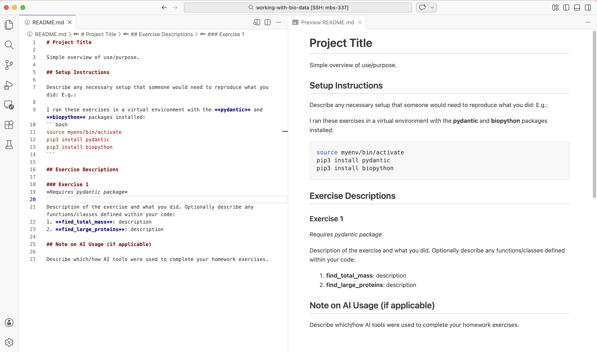

Documentation
=============

As we have probably all heard before, good documentation is almost as important
(if not equally as important) as good code itself. You may have written some
elegant and powerful code to solve your problems today, but weeks or months
from now, that code may become functionally useless if you forget what it does or
how to call it. Python3 users have a special built-in tool at their disposal
called **docstrings** that make documenting functions easy. After going through
this module, students should be able to:

* Write well-crafted docstrings for all functions
* Add type hints to function definitions
* Write effective READMEs for a project

Docstrings
----------

Docstrings are special strings that appear immediately following function
definitions in our code. They should be surrounded by three double-quotation
marks on each side, and they may span multiple lines. For example:

.. code-block:: python3

   def a_function():
       """
       This is a docstring.
       """
       # code goes here
       return

The above is a valid docstring, but it is not a very helpful docstring. When you
write docstrings, at a minimum try to include the following sections:

1. A short description of the purpose of the function
2. A list of arguments, including type
3. A list of returned values, including type

A better template for a docstring (based on the
`Google Style Guide <https://google.github.io/styleguide/pyguide.html#38-comments-and-docstrings>`_)
might look like:

.. code-block:: python3

   def a_function(arg1: type, arg2: type) -> type:
       """
       This function does XYZ.

       Args:
           arg1: Define what is expected for arg1.
           arg2: Define what is expected for arg2.

       Returns:
           result: Define what is expected for result.
       """
       # code goes here
       return(result)

The description should be succinct, yet complete. Arguments should be listed by
name and the expected type (e.g., bool, float, str, etc.) should be stated.
The return result(s) should be listed along with the expected type(s).

Let's look at one more example using a real function:

.. code-block:: python3

   def add_and_square(num1: float, num2: float) -> float:
       """
       Given two numbers, this function will first add them together, then square the sum
       and return the result.

       Args:
           num1: The first number.
           num2: The second number.

       Returns:
           result: The square of the sum of input arguments.
       """
       result = (num1+num2)**2
       return(result)

.. note::

   Notice above we are using more-or-less complete sentences with proper grammar.

EXERCISE
~~~~~~~~

Let's add docstrings to our ``fastq_summary.py`` code we've been working on:

.. code-block:: python3 

    def summarize_record(record) -> ReadSummary:
        phred_scores = record.letter_annotations['phred_quality']
        average_phred = sum(phred_scores) / len(phred_scores)

        return ReadSummary(
            id=record.id,
            sequence=str(record.seq),
            total_bases=len(record.seq),
            average_phred=round(average_phred, 2)
        )

.. code-block:: python3 

    def summarize_fastq_file(fastq_file: str, encoding: str) -> FastqSummary:
        reads_list = []

        with open(fastq_file, 'r') as f:
            for record in SeqIO.parse(f, encoding):
                reads_list.append(summarize_record(record))

        return FastqSummary(reads=reads_list)

.. code-block:: python3 

    def write_summary_to_json(summary: FastqSummary, output_file: str) -> None:
        with open(output_file, 'w') as outfile:
            json.dump(summary.model_dump(), outfile, indent=2)

.. toggle:: Click

    .. code-block:: python3 

        def summarize_record(record) -> ReadSummary:
            """
            Given a single FASTQ record, extract basic read statistics and 
            return them as a ReadSummary instance 

            Args:
                record: A single FASTQ SeqRecord produced by BioPython's SeqIO 
                    parser, containing the read ID, sequence, and per-base Phred 
                    quality scores. 
            
            Returns: 
                ReadSummary: A ReadSummary instance containing the read ID, sequence, 
                    total number of bases, and average phred quality score. 
            """
            phred_scores = record.letter_annotations['phred_quality']
            average_phred = sum(phred_scores) / len(phred_scores)

            return ReadSummary(
                id=record.id,
                sequence=str(record.seq),
                total_bases=len(record.seq),
                average_phred=round(average_phred, 2)
            )

    .. code-block:: python3 

        def summarize_fastq_file(fastq_file: str, encoding: str) -> FastqSummary:
            """
            Given as FASTQ file, this function iterates over all reads in the file, 
            summarizes each read, and returns the results as a FastqSummary instance. 

            Args: 
                fastq_file: Path to the input FASTQ file 
                encoding: FASTQ format string used by BioPython to interpret sequence 
                    and quality score data. 

            Returns:
                FastqSummary: A FastqSummary instance containing summaries for all reads 
                    in the input FASTQ file. 
            """
            reads_list = []

            with open(fastq_file, 'r') as f:
                for record in SeqIO.parse(f, encoding):
                    reads_list.append(summarize_record(record))

            return FastqSummary(reads=reads_list)

    .. code-block:: python3 

        def write_summary_to_json(summary: FastqSummary, output_file: str) -> None:
            """
            Given a FastqSummary instance, serialize the data and write it to a JSON file. 

            Args: 
                summary: A FastqSummary object containing per-read summary data.
                output_file: Path to the output JSON file.

            Returns:
                None: This function does not return a value; it writes output to disk. 
            """
            with open(output_file, 'w') as outfile:
                json.dump(summary.model_dump(), outfile, indent=2)

Helpful Python Functions 
~~~~~~~~~~~~~~~~~~~~~~~~~

The ``dir()`` function is a built-in Python tool used to list the attributes (methods, variables, etc.) 
of an object (a string, list, dictionary, class instance, or module). For **built-in types**, it will list 
all the methods you can use with that specific data type. For **modules**, it prints all the functions, classes 
and constants available within that module:

Open the Python3 interpreter, import your ``models.py`` and ``fastq_summary.py`` modules, and explore using the 
``dir()`` function:

.. code-block:: python3 

    >>> import models, fastq_summary
    >>> my_string = "hello world"
    
    # Inspecting an object instance 
    >>> dir(my_string)
    ['__add__', '__class__', 'capitalize', 'casefold', 'center', 'count', ...]

    # Inspecting a module 
    >>> dir(models)
    ['BaseModel', 'FastqSummary', 'ReadSummary', '__builtins__', '__cached__', ...]

    >>> dir(fastq_summary)
    ['FastqSummary', 'ReadSummary', 'SeqIO', '__builtins__', ..., 'json', 'main', 'summarize_fastq_file', 'summarize_record', 'write_summary_to_json']

Now that we've inspeced our modules, we can use the ``help()`` function to learn how to use them:

.. code-block:: python3 

    >>> help(str)
    >>> help(str.capitalize)

    >>> help(models)
    >>> help(models.ReadSummary)

    >>> help(fastq_summary)
    >>> help(fastq_summary.write_summary_to_json)

What do you notice about the output of that last command? It contains the information that you put into the 
docstring! 

Type Hints 
----------

Type hints in function definitions indicate what types are expected as input and output of a function. 
We briefly went over type hints in the `JSON material <http://127.0.0.1:7898/unit02/json.html#work-with-json-data>`_, 
but let's talk more about how they work. 

No checking actually happens at runtime, so if you send the wrong type of data as an argument, the type hint itself 
won't cause an error. Think of type hints as documentation or annotations to help the reader understand how to use 
a function. 

.. warning:: 

    In the code blocks below, we omit docstrings for brevity only. Please continue including docstrings in your 
    code. 

Type hints take the form:

.. code-block::

    def a_function(arg_name: arg_type) -> return_type:
        # code goes here
        return result 

In the above example, we are providing a single argument called ``arg_name`` that should be of type ``arg_type``. 
The expected return value should be a ``return_type``. Let's look at an example using a real function:

.. code-block:: python3 

    def add_and_square(num1: float, num2: float) -> float:
        result = (num1+num2)**2
        return(result)

Although Python3 does not check or enforce types at run time, there are other
tools that make use of type hints to check types at the time of development. For
example, some IDEs (including PyCharm) will evaluate type hints as you write code
and provide an alert if you call a function in a way other than what the type
hint suggests. In addition, there are Python3 libraries like *mypy* that can wrap
your Python3 programs and check / evaluate type hints as you go, provided errors
where types don't match.

.. warning::

    Be aware that there is some redundancy in the information contained in type hints
    and in the docstrings. Be careful not to let them get out of sync as your code
    evolves.

README
------

A README file should be included at the top level of every coding project you
work on. Websites like GitHub will automatically look for README files and render
them directly in the web interface. Markdown is probably the most common syntax
people use to write READMEs. It is very easy to create headers, code blocks,
tables, text emphases, and other fancy renderings to make the README pleasant and
easy to read.

.. note::

   In this class we ask you to include READMEs in each of your homework folders
   on GitHub. Each homework is essentially a standalone project, so a dedicated
   README for each is warranted.

At a minimum, plan to include the following sections in all of your READMEs:

* Title: a descriptive, self-explanatory title for the project.
* Description: a high-level description of the project that informs the reader
  what the code does, why it exists, what problem it solves, etc.
* Installation: As we advance into the semester our code bases will become more
  complex with more moving parts. Eventually we will need to start providing
  detailed instructions about getting the project working plus any requirements.
* Usage: The key here is **examples**! Show code blocks of what it looks like
  to execute the code from start to finish. Describe what output is expected and
  how it should be interpreted.

Other general advice includes:

* Use proper grammar and more-or-less complete sentences.
* Use headers, code blocks, and text emphases (e.g. bold, italics) to make the
  document readable. 
* Be prepared to include other information about authors, acknowledgements, and
  licenses in the READMEs as appropriate
* Spend some time browsing GitHub and look for READMEs of other popular projects.
  There are many correct ways to write a README.
* VS Code supports previewing Markdown files–you just just start writing Markdown text,
  save the file with the ``.md`` extension, and then toggle the visualization with ``⇧⌘V`` 
  on a Mac, or simply right-click the file and select ``Open Preview``.

    The raw README.md file and its preview displayed side-by-side in VS Code. 

Remember, the README is your chance to document for yourself and explain to others
why the project is important, what the code is, and how to use it / interpret the
outputs. The advice above is general advice, but it is not one-size-fits-all.
Every project is different and ultimately your README may include other sections
or organization schemes that are unique to your project.

Additional Resources
--------------------

* Many of the materials in this module were adapted from `COE 332: Software Engineering & Design <https://coe-332-sp26.readthedocs.io/en/latest/unit03/documentation.html>`_
* `Google Style Guide for docstrings <https://google.github.io/styleguide/pyguide.html#38-comments-and-docstrings>`_
* `Type hints spec <https://www.python.org/dev/peps/pep-0484/>`_
* `Mypy project <http://mypy-lang.org/index.html>`_
* `Markdown syntax <https://www.markdownguide.org/basic-syntax/>`_
* `Tips on writing a good README <https://www.makeareadme.com/>`_
* `Markdown and Visual Studio Code <https://code.visualstudio.com/docs/languages/markdown>`_